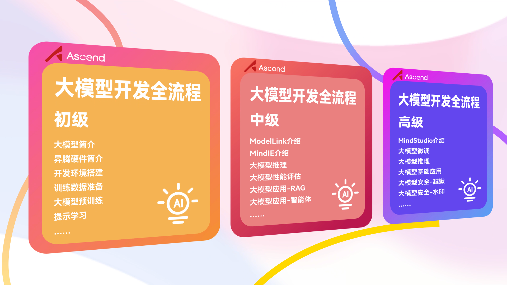
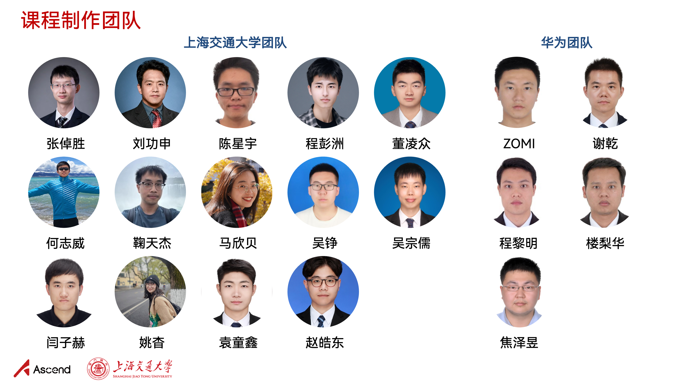
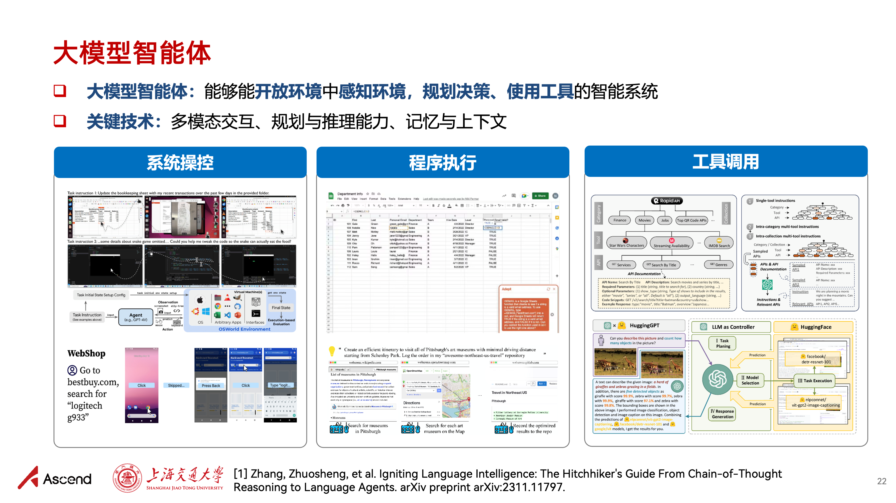

<h1 align="center">Hands-on Learning Large Language Models - Programming Practice Tutorial Series</h1>

  	
  
  
   	
  	
    
     

  <a href="#project-motivation">Project Motivation</a>/
  <a href="#tutorial-table-of-contents">Tutorial Table of Contents</a>/
  <a href="#contributors-list">Contributors List</a>

## 💡 Updates

2025/06/06  Thank you all for your attention and positive feedback! We have updated this tutorial from the following two aspects:

- [x] Launched a domestically localized "Complete LLM Development Workflow" public welfare tutorial (including PPT, experimental manual, and videos). Special thanks to the support from Huawei Ascend Community!
- [x] Updated the content based on the original series of programming practice tutorials and added new topics (mathematical reasoning, GUI Agent, LLM alignment, steganography, etc.)!

## 🎯 Project Motivation

The "Hands-on Learning Large Language Models" series of programming practice tutorials, expanded from the lectures of Shanghai Jiao Tong University's "Frontier Techniques in Natural Language Processing" (NIS8021) and "Artificial Intelligence Security Technology" course (NIS3353) (Instructor: [Zhang Zhuosheng](https://bcmi.sjtu.edu.cn/home/zhangzs/)), aims to provide a beginner's programming reference for large language models. This tutorial is public welfare in nature and completely free. Through simple practice, it helps students quickly get started with large language models and better conduct course design or academic research.

## 📚 Tutorial Table of Contents

| Tutorial Content         | Description                                                         | Link                                                         |
| ---------------- | ------------------------------------------------------------ | ------------------------------------------------------------ |
| Fine-tuning and Deployment       | Fine-tuning and deployment guide for pre-trained models: Want to improve the performance of pre-trained models on specific tasks? Let's select appropriate pre-trained models, fine-tune them on specific tasks, and deploy the fine-tuned models into convenient demos! | [[Slides](https://github.com/Lordog/dive-into-llms/tree/main/documents/chapter1/dive-into-llm.pdf)] [[Tutorial](https://github.com/Lordog/dive-into-llms/tree/main/documents/chapter1/README.md)] [[Script](https://github.com/Lordog/dive-into-llms/tree/main/documents/chapter1/dive-tuning.ipynb)] |
| Prompt Learning and Chain of Thought | API calls and inference guide for large language models: "AI seeking encouragement online? Large language models' answers to some questions can be shocking, but it may just want a word of 'encouragement'" | [[Slides](https://github.com/Lordog/dive-into-llms/tree/main/documents/chapter2/dive-into-prompting.pdf)] [[Tutorial](https://github.com/Lordog/dive-into-llms/tree/main/documents/chapter2/README.md)] [[Script](https://github.com/Lordog/dive-into-llms/tree/main/documents/chapter2/dive-prompting.ipynb)] |
| Knowledge Editing         | Editing methods and tools for language models: Want to control language model memory of specific knowledge? Let's select appropriate editing methods, edit specific knowledge, and validate the edited models! | [[Slides](https://github.com/Lordog/dive-into-llms/blob/main/documents/chapter3/dive_edit_0410.pdf)] [[Tutorial](https://github.com/Lordog/dive-into-llms/tree/main/documents/chapter3/README.md)]  [[Script](https://github.com/Lordog/dive-into-llms/tree/main/documents/chapter3/dive_edit.ipynb)] |
| Mathematical Reasoning         | How to enable large language models to learn mathematical reasoning? Let's quickly distill a mini R1! | [[Slides](https://github.com/Lordog/dive-into-llms/blob/main/documents/chapter4/math.pdf)] [[Tutorial](https://github.com/Lordog/dive-into-llms/tree/main/documents/chapter4/README.md)]  [[Script](https://github.com/Lordog/dive-into-llms/tree/main/documents/chapter4/sft_math.ipynb)] |
| Model Watermarking         | Text watermarking for language models: Embed invisible watermarks in content generated by language models | [[Slides](https://github.com/Lordog/dive-into-llms/blob/main/documents/chapter5/watermark.pdf)] [[Tutorial](https://github.com/Lordog/dive-into-llms/tree/main/documents/chapter5/README.md)]  [[Script](https://github.com/Lordog/dive-into-llms/tree/main/documents/chapter5/watermark.ipynb)] |
| Jailbreak Attacks         | To achieve better security, start by learning to attack. Let's understand how jailbreak attacks pry open large language models' mouths! | [[Slides](https://github.com/Lordog/dive-into-llms/blob/main/documents/chapter6/dive-Jailbreak.pdf)] [[Tutorial](https://github.com/Lordog/dive-into-llms/tree/main/documents/chapter6/README.md)] [[Script](https://github.com/Lordog/dive-into-llms/tree/main/documents/chapter6/dive-jailbreak.ipynb)] |
| LLM Steganography       | "Invisible ink"! Want to have large language models smoothly answer questions while covertly carrying information that only "insiders" can recognize? LLM steganography tells you how! | [[Slides](https://github.com/Lordog/dive-into-llms/blob/main/documents/chapter7/stega.pdf)] [[Tutorial](https://github.com/Lordog/dive-into-llms/tree/main/documents/chapter7/README.md)] [[Script](https://github.com/Lordog/dive-into-llms/tree/main/documents/chapter7/llm_stega.ipynb)] |
| Multimodal Models       | As multimodal large language models that can more fully simulate the real world, how can they achieve stronger multimodal understanding and generation capabilities? Can multimodal large language models help achieve AGI? | [[Slides](https://github.com/Lordog/dive-into-llms/blob/main/documents/chapter8/mllms.pdf)]  [[Tutorial](https://github.com/Lordog/dive-into-llms/tree/main/documents/chapter8/README.md)] [[Script](https://github.com/Lordog/dive-into-llms/tree/main/documents/chapter8/mllms.ipynb)] |
| GUI Agent        | Want to have food handed to your mouth and free your hands? Then let's work together to have AI Agent order takeout, reply to messages, and compare shopping prices for you! | [[Slides](https://github.com/Lordog/dive-into-llms/blob/main/documents/chapter9/GUIagent.pdf)]  [[Tutorial](https://github.com/Lordog/dive-into-llms/tree/main/documents/chapter9/README.md)] [[Script](https://github.com/Lordog/dive-into-llms/tree/main/documents/chapter9/GUIagent.ipynb)] |
| Agent Safety       | Large language model agents are on a journey toward future operating systems. However, can large language models be aware of risk threats in open agent scenarios? | [[Slides](https://github.com/Lordog/dive-into-llms/blob/main/documents/chapter10/dive-into-safety.pdf)] [[Tutorial](https://github.com/Lordog/dive-into-llms/tree/main/documents/chapter10/README.md)] [[Script](https://github.com/Lordog/dive-into-llms/tree/main/documents/chapter10/agent.ipynb)] |
| RLHF Safety Alignment     | PPO-based RLHF experiment guide: This tutorial is "extremely dangerous". After reading, please check if your large language model is smirking. | [[Slides](https://github.com/Lordog/dive-into-llms/blob/main/documents/chapter11/RLHF.pdf)] [[Tutorial](https://github.com/Lordog/dive-into-llms/tree/main/documents/chapter11/README.md)] [[Script](https://github.com/Lordog/dive-into-llms/tree/main/documents/chapter11/RLHF.ipynb)] |

## 🔥 New Launch: Domestically Localized "Complete LLM Development Workflow"

- **✨ Our jointly launched with Huawei Ascend "Complete LLM Development Workflow" public welfare tutorial is now officially online! Cutting-edge technology + code practice, hands-on learning to master AI large language models ✨**: 

  Based on the original series of "Hands-on Learning Large Language Models" tutorials, we partnered with Huawei to develop the "Complete LLM Development Workflow" series of courses. This series of tutorials is based on Ascend basic software and hardware development, covering tutorial formats such as PPT, experimental manuals, and videos. The tutorial is divided into beginner, intermediate, and advanced series, targeting different large language model practice needs. It aims to provide researchers and developers with quick hands-on guides and comprehensive development guides for model migration and optimization supported by Ascend through code practice in a progressive manner.
  
- **🚀 Explore the "Complete LLM Development Workflow" series courses at Ascend Community**： 
  
  👉《[Large Language Model Development Learning Zone](https://www.hiascend.com/edu/growth/lm-development#classification-floor-1)》@ Ascend Community 👈 
  
- **✨ Course Content Display ✨**

  <!-- 
  
  
   -->

  
  
  
  

## 🙏 Disclaimer

All content of this tutorial comes solely from the personal experience of contributors, internet data, and related accumulations from daily research work. All techniques are for reference only and are not guaranteed to be 100% correct. If you have any questions, please feel free to submit an Issue or PR. Also, the badges used in this project are from the internet. If we have infringed your image copyright, please contact us to delete it. Thank you.

## 🤝 Welcome to Contribute

This tutorial is currently an ongoing project, and oversights are inevitable. We welcome any PRs and issue discussions.

## ❤️ Contributors List

Thank you to the following teachers and students for their support and contributions to this project:

**"Hands-on Learning Large Language Models" Tutorial Development Team:**

- Shanghai Jiao Tong University: [Zhang Zhuosheng](https://bcmi.sjtu.edu.cn/home/zhangzs/), [Yuan Tongxin](https://github.com/Lordog), [Ma Xinbei](https://scholar.google.com/citations?user=LpUi3EgAAAAJ&hl=zh-CN&oi=ao), [He Zhiwei](https://zwhe99.github.io), [Du Wei](https://scholar.google.com/citations?user=tFYUBLkAAAAJ&hl=en), [Zhao Haodong](https://dongdongzhaoup.github.io/), [Wu Zongru](https://zrw00.github.io/), [Wu Zheng](https://wuzheng02.github.io/), [Dong Lingzhong](https://github.com/LZ-Dong), [Zhang Yulong](https://aslan-yulong.github.io/)

- National University of Singapore: [Fei Hao](http://haofei.vip/)

**"Complete LLM Development Workflow" Tutorial Development Team:**

- Shanghai Jiao Tong University: [Zhang Zhuosheng](https://bcmi.sjtu.edu.cn/home/zhangzs/), [Liu Gongshen](https://infosec.sjtu.edu.cn/DirectoryDetail.aspx?id=75), [Chen Xingyu](https://scholar.google.com/citations?user=d-dNtjrMJ5YC&hl=en), [Cheng Pengzhou](https://scholar.google.com/citations?user=qxnwzDUAAAAJ&hl=en), [Dong Lingzhong](https://github.com/LZ-Dong), [He Zhiwei](https://zwhe99.github.io), [Ju Tianjie](https://scholar.google.com/citations?user=f8PPcnoAAAAJ&hl=en), [Ma Xinbei](https://scholar.google.com/citations?user=LpUi3EgAAAAJ&hl=zh-CN&oi=ao), [Wu Zheng](https://scholar.google.com/citations?hl=zh-CN&user=qBM1UbUAAAAJ&view_op=list_works&gmla=AIfU4H6PG9JyjRub6BYIIZ4isQE7MBAM3Eoec6OJfX4z_8-pOE8bI1Wgdo3XL5qOZWR3U-h-lIP2q0zXt5gzyFKMSg7MNnBBWLv5d1IVG30UANczTP0), [Wu Zongru](https://zrw00.github.io/), [Yan Zihe](https://scholar.google.com/citations?user=O2YfSHoAAAAJ&hl=zh-CN), [Yao Yao](https://scholar.google.com/citations?user=tLMP3IkAAAAJ), [Yuan Tongxin](https://github.com/Lordog), [Zhao Haodong](https://dongdongzhaoup.github.io/);

- Huawei Ascend Community: ZOMI, Xie Qian, Cheng Liming, Lou Lihua, Jiao Zeyu

## 🌟 Star History

