# Fine-tuning and Deployment of Pre-trained Language Models

> Introduction: This section covers fine-tuning of pre-trained models
Want to improve the performance of pre-trained models on specific tasks? Let us select suitable pre-trained models, fine-tune them on specific tasks, and deploy the fine-tuned models as convenient-to-use demos!

## Tutorial Objectives:
1. Become familiar with using the Transformers toolkit
2. Master fine-tuning and inference of pre-trained models (decoupled customizable version & default integrated version)
3. Master demo deployment using Gradio Spaces
4. Understand model selection and application scenarios for different types of pre-trained models

## Tutorial Contents:

### 1. Preparation:
#### 1.1 Understanding the Toolkit: Transformers
https://github.com/huggingface/transformers

> 🤗 Transformers provides APIs and tools that make it easy to download and train state-of-the-art pre-trained models. Using pre-trained models can reduce computational consumption and carbon emissions, and save the time and resources required for training from scratch. These models support common tasks in different modalities, such as:
📝 Natural Language Processing: text classification, named entity recognition, question answering, language modeling, summarization, translation, multiple choice, and text generation.
🖼️ Computer Vision: image classification, object detection, and semantic segmentation.
🗣️ Audio: automatic speech recognition and audio classification.
🐙 Multimodal: table question answering, optical character recognition, information extraction from scanned documents, video classification, and visual question answering.

Detailed documentation: https://huggingface.co/docs/transformers/main/en/index

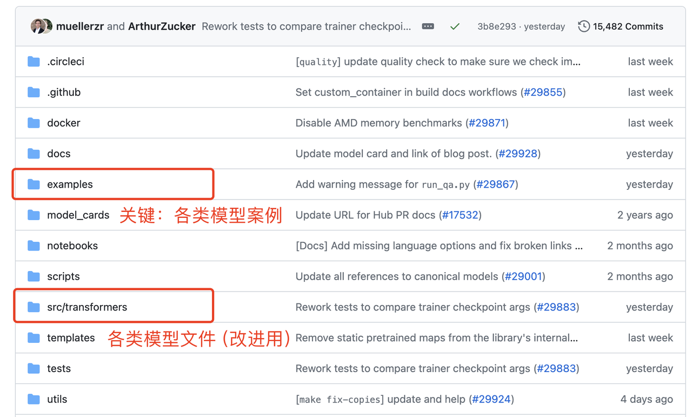

#### 1.2 Setting up the Environment: Text Classification Example (e.g., Fake News Detection)
1. We enter the text classification example repository, consult the readme to understand key parameters, and download requirements.txt and run_classification.py

https://github.com/huggingface/transformers/tree/main/examples/pytorch/text-classification

2. Set up the environment:
- 1. Create a new environment using conda: conda create -n llm python=3.9
- 2. Activate the virtual environment: conda activate llm
- 3. pip install transformers
- 4. Remove torch from requirements.txt and install: pip install -r requirements.txt

> If download speed is slow, you can use a domestic mirror: pip [Packages] -i https://pypi.tuna.tsinghua.edu.cn/simple

> If using a domestic mirror to install PyTorch, it will automatically select the CPU version of PyTorch, which cannot run on GPU, so——

- 5. conda install pytorch

> If download speed is slow, configure a conda mirror according to this blog: https://blog.csdn.net/weixin_42797483/article/details/132048218

3. Prepare data: We use the fake tweets dataset from Kaggle as an example: https://www.kaggle.com/c/nlp-getting-started/data

#### 1.3 Prepared Engineering Package (Demo Code and Data)
(1) Decoupled customizable version (key modules are decoupled, easy to understand, can customize data loading, model structure, evaluation metrics, etc.)

[TextClassificationCustom Download Link](https://drive.google.com/file/d/12cVWpYbhKVLTqOEKbeyj_4WcFzLd_KJX/view?usp=drive_link)

(2) Default integrated version (code is more abundant and complex, generally direct hyperparameter calling, with some development threshold)

[TextClassification Download Link](https://drive.google.com/file/d/10jnqREVDddmOUH4sbHvl-LiPn6uxj57B/view?usp=drive_link)


### 2. Customized Development Based on Decoupled Version (Minimum Viable Product MVP)
Three main files: main.py main program, utils_data.py data loading and processing file, modeling_bert.py model structure file

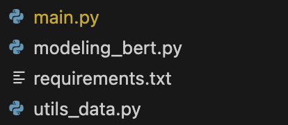

#### 2.1 Understanding Key Modules
1. Load and process data (utils_data.py)
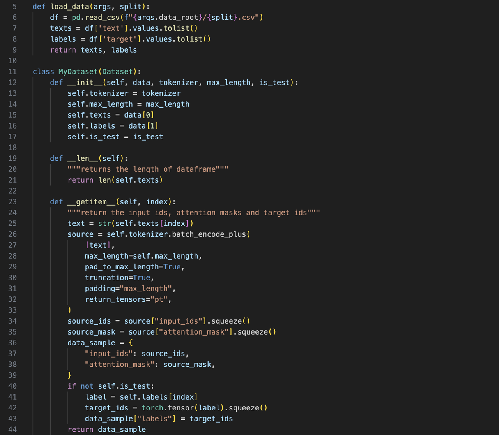

2. Load model (modeling_bert.py)


3. Training/Validation/Prediction (main.py)

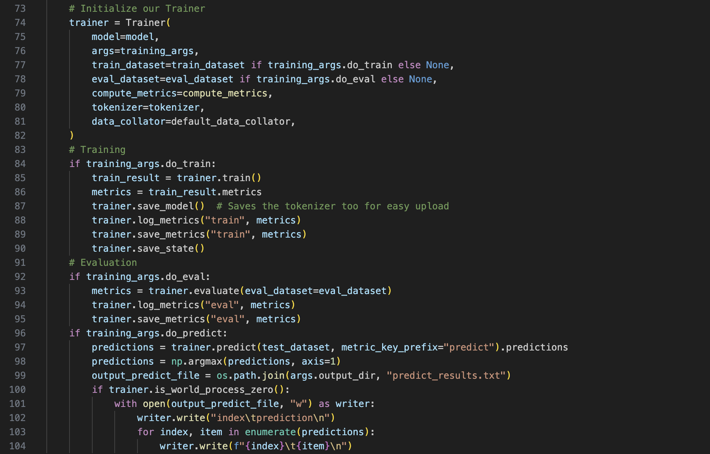

#### 2.2 Run Complete Training/Validation/Prediction Pipeline
```shell
python main.py
```

### 3. Fine-tuning Based on Integrated Version (Optional, based on run_classification.py)

#### 3.1 Understanding Key Modules:
1. Load data (csv or json format)
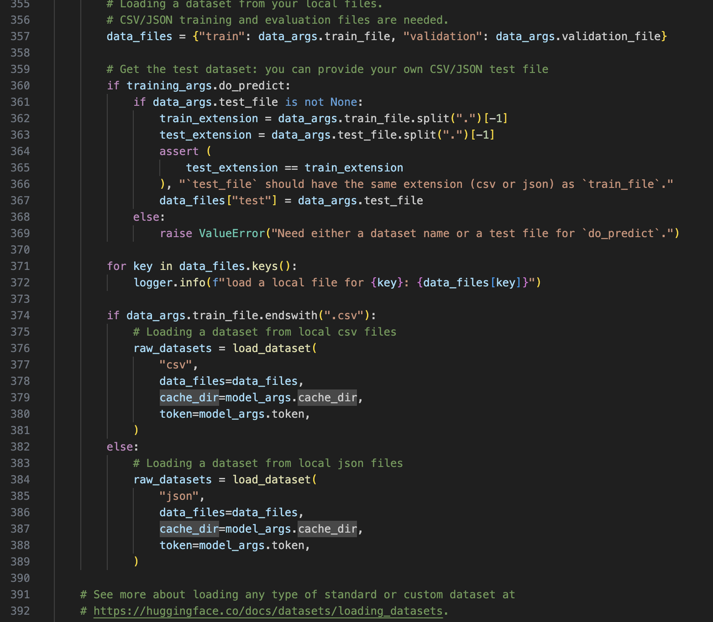

2. Process data
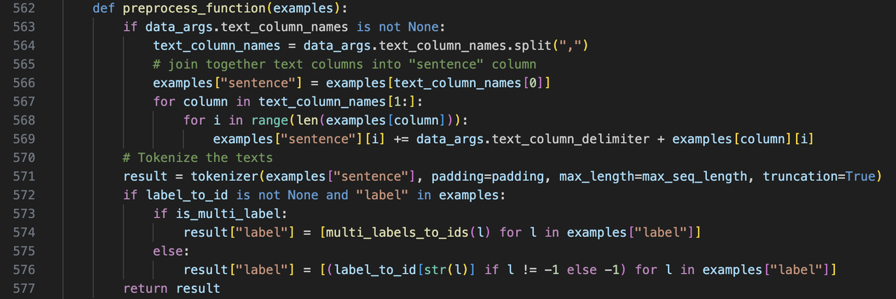

3. Load model
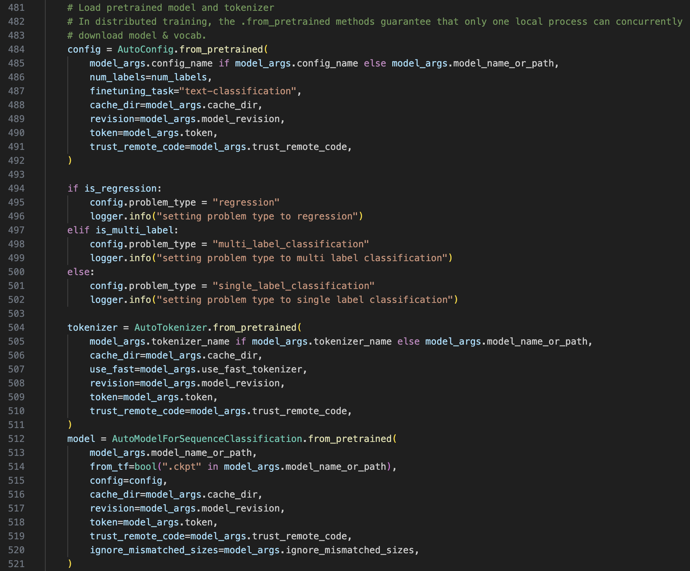

4. Training/Validation/Prediction
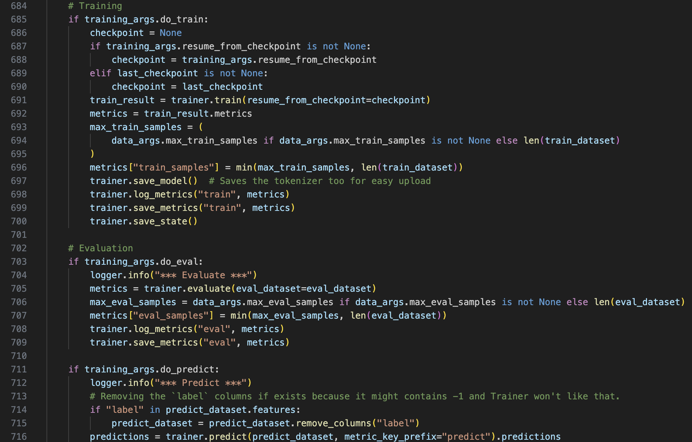

#### 3.2 Train Model
Validate on development set and predict on test set at the same time by executing the following script:

```shell
python run_classification.py \
    --model_name_or_path  bert-base-uncased \
    --train_file data/train.csv \
    --validation_file data/val.csv \
    --test_file data/test.csv \
    --shuffle_train_dataset \
    --metric_name accuracy \
    --text_column_name "text" \
    --text_column_delimiter "\n" \
    --label_column_name "target" \
    --do_train \
    --do_eval \
    --do_predict \
    --max_seq_length 512 \
    --per_device_train_batch_size 32 \
    --learning_rate 2e-5 \
    --num_train_epochs 1 \
    --output_dir experiments/
```

If errors occur or the process hangs, it is usually a network issue:

1. <u>If "Network is unreachable" appears when downloading the model, manually download the model locally: https://huggingface.co/google-bert/bert-base-uncased</u>
2. <u>If the process hangs after adding data, press CTRL+C to stop and it shows hanging at "connection", this is due to network connection failure when the evaluate package loads evaluation metrics.</u>

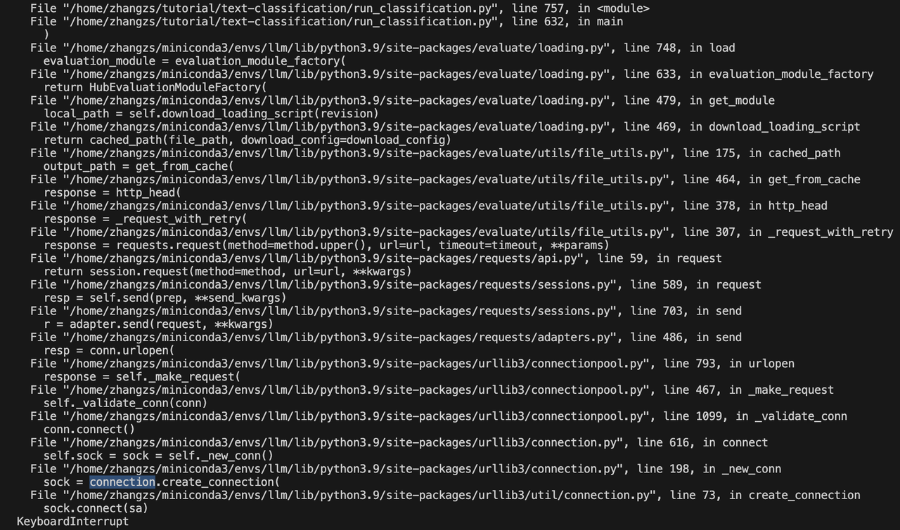

In this case, you can download the entire evaluate package from its GitHub: https://github.com/huggingface/evaluate/tree/main, and change the --metric_name path in hyperparameters to the local metric path:

```shell
python run_classification.py \
    --model_name_or_path  bert-base-uncased \
    --train_file data/train.csv \
    --validation_file data/val.csv \
    --test_file data/test.csv \
    --shuffle_train_dataset \
    --metric_name evaluate/metrics/accuracy/accuracy.py \
    --text_column_name "text" \
    --text_column_delimiter "\n" \
    --label_column_name "target" \
    --do_train \
    --do_eval \
    --do_predict \
    --max_seq_length 512 \
    --per_device_train_batch_size 32 \
    --learning_rate 2e-5 \
    --num_train_epochs 1 \
    --output_dir experiments/
```

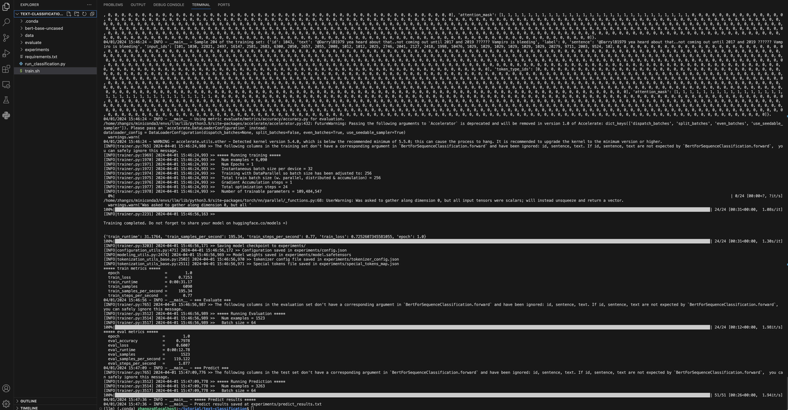


### 4. Deploy Model: After model training is complete, we can build online demos on Gradio Spaces
#### 4.1 Gradio Spaces Tutorial
https://huggingface.co/docs/hub/en/spaces-sdks-gradio
#### 4.2 Create Spaces
1. https://huggingface.co/new-space?sdk=gradio
2. Note: If the page doesn't load, try using a VPN


#### 4.3 Key Inference Code
See app.py in the engineering package for details

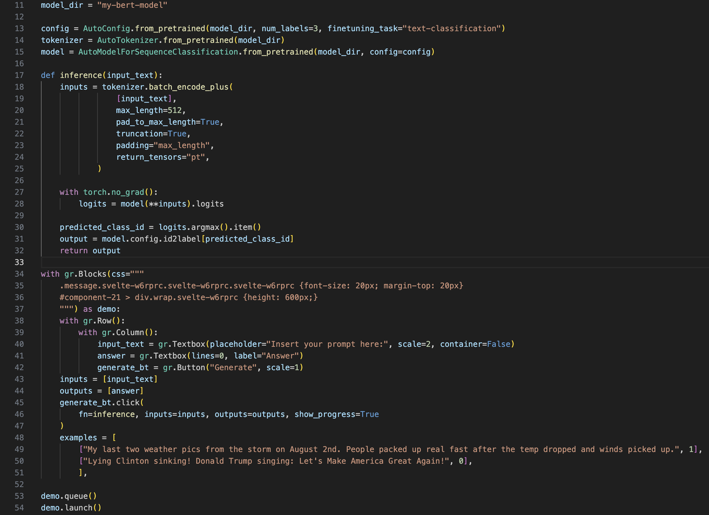

#### 4.4 Upload app.py, Environment Configuration Files, and Model to Gradio Spaces
1. Configuration file (requirements.txt)
```
transformers==4.30.2
torch==2.0.0
```

2. File Overview

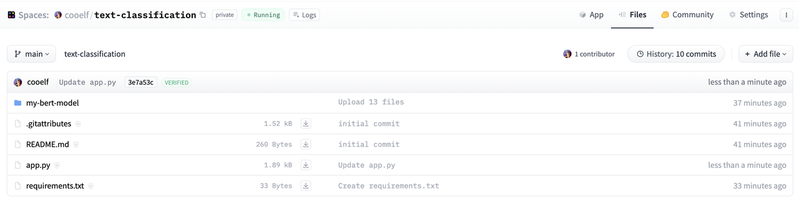


3. Demo Effect
For reference, see a successfully deployed example: https://huggingface.co/spaces/cooelf/text-classification
You can see the source code in the "Files" section in the top right corner.

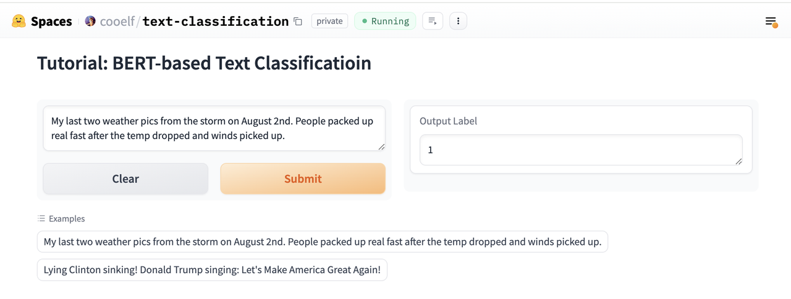


4. Easter Egg: On the Spaces platform, you can see trending demos every week, and search for large models and demos you are interested in to try

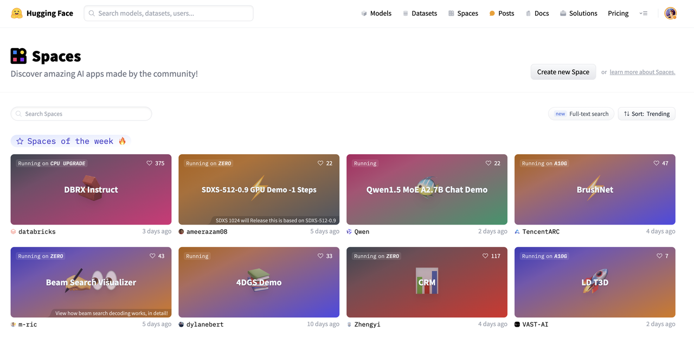


### 5. Advanced Exercises
1. Try other classification/regression tasks, such as sentiment classification, news classification, vulnerability classification, etc.
2. Try other types of models, such as T5, ELECTRA, etc.

### 6. Other Common Models
1. Question answering model: https://github.com/huggingface/transformers/tree/main/examples/pytorch/question-answering
2. Text summarization: https://github.com/huggingface/transformers/tree/main/examples/pytorch/summarization
3. Inference with Llama2: https://huggingface.co/docs/transformers/en/model_doc/llama2
4. Lightweight fine-tuning (LoRA) of Llama2: https://github.com/peremartra/Large-Language-Model-Notebooks-Course/blob/main/5-Fine%20Tuning/LoRA_Tuning_PEFT.ipynb


### 7. Further Reading
1. A comprehensive 43-page [survey](https://mp.weixin.qq.com/s?__biz=Mzk0MTYzMzMxMA==&mid=2247484539&idx=1&sn=6ee42baab4ad792e74ac6a89d7dd87d9&chksm=c2ce3e0af5b9b71c578cb6836e09cce5f60b4a1cfffadc1c4c98211fc0af621bfaaaa8fe0aff&mpshare=1&scene=24&srcid=0331FO6iqVqs5Vx3iHrtqouQ&sharer_shareinfo=45c3fb78d9cfb9627908da44dd7f5559&sharer_shareinfo_first=45c3fb78d9cfb9627908da44dd7f5559&key=a2847c972f830c4143e00e0430f657d8ab5acae4ad24ca628213273021453a3a9e17984627e2ab8506d1dcf6e1fabd9ec3123a5f71d2a65295ad6f6f56da2224d4a6e3228237c237447bbf48a6eff1f53e1971503f26c3fb5b9d99d27eca7266529a5f86d75bada7ec10bf314687bfcbf9fa3b09b8e36e73f6d6a154a5ce5ff0&ascene=14&uin=NzE3NzkyOTQx&devicetype=iMac20%2C1+OSX+OSX+14.2.1+build(23C71)&version=13080610&nettype=WIFI&lang=zh_CN&countrycode=CN&fontScale=100&exportkey=n_ChQIAhIQM7tgcovlhXp1y5J%2BRMnhfhL3AQIE97dBBAEAAAAAAFsTBwTm4FMAAAAOpnltbLcz9gKNyK89dVj0MxFZswDc%2Fk646vJPW2S3JFh8H2JhyZXiPbIl%2Bh23CsewrmIoZ4j0D2zMNylC3pLbhu9FIARUKYn%2F0r0OIdHnxesVFpw1qLo6uBJ3zmbsKBVXM05%2B0MiOBIfShfpiIfraK7THzak94U0RdS1flC%2BIDjTb5SmZs9Z4XTyTsN0QXR6NWjAXFeuxnMB4SENMJ8dUR8n08b3DGKtz9rfefn0JRlsX4mGcLvOFsFwg4nk35nl4C3Wgcs4OYociKm5UHabdhWT7%2FWbNNToZLD39eD%2FL4Xo%3D&acctmode=0&pass_ticket=8xG4QKOnJeEFUtXkScVmMqb3omdWJbPuc%2BhN5%2BA7%2FOXj7ex757M2ABNO4GVVnv2T3VtqrC9gZH%2FrU09rrUxJcA%3D%3D&wx_header=0) on Large Language Models (LLMs) for comprehensive in-depth analysis (by Word2Vec author)
   
    Paper title: Large Language Models: A Survey

    Paper link: https://arxiv.org/pdf/2402.06196.pdf

2. [GPT, GPT-2, GPT-3 Paper Deep Dive [Paper Deep Dive]](https://www.bilibili.com/video/BV1AF411b7xQ?t=0.0)

3. [InstructGPT Paper Deep Dive [Paper Deep Dive·48]](https://www.bilibili.com/video/BV1hd4y187CR?t=0.4)
