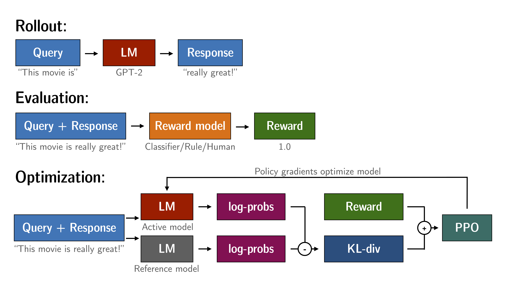
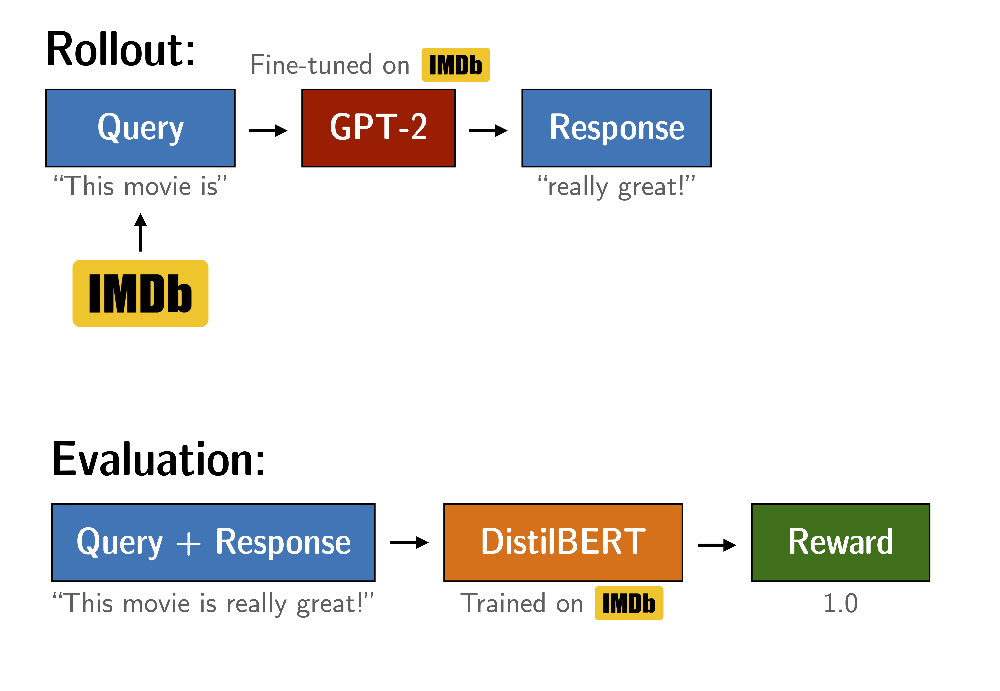
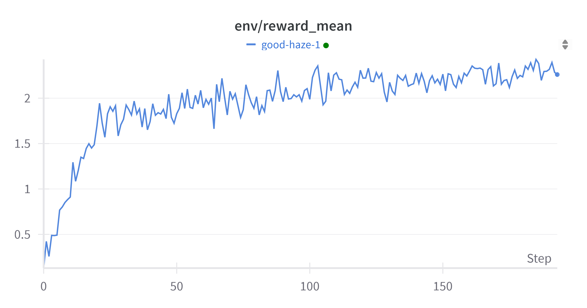

# Hands-on Learning with Large Models: RLHF

> This experimental manual translates and integrates online resources [blog](https://newfacade.github.io/notes-on-reinforcement-learning/17-ppo-trl.html) & [trl examples](https://github.com/huggingface/trl/blob/main/examples/notebooks/gpt2-sentiment.ipynb)

Reproduction setup: Single-card NVDIA A800-SXM4-80GB uses 10097MiB, training takes 35min19s.

Reading tutorial: [slide](./RLHF.pdf)

Notebook: [notebook](./RLHF.ipynb)

## How PPO Works
1. Rollout: The language model generates responses based on queries.
2. Evaluation: Queries and responses are evaluated using functions, models, human feedback, or some combination of these. This process should generate a **scalar value** for each query/response pair.
3. Optimization: In the optimization step, query/response pairs are used to compute log probabilities of tokens in the sequence. This is done through the trained model and reference model. The KL divergence between the two outputs is used as an additional reward signal to ensure that generated responses do not deviate too far from the reference language model. The PPO algorithm then trains the active language model.
<div style="text-align: center">

<p style="text-align: center;"> <b>Figure:</b> PPO workflow diagram </p>
</div>

# Fine-tuning GPT-2 to Generate Positive Reviews  
> Optimize GPT-2 to generate positive IMDB movie reviews by using a BERT sentiment classifier as the reward function.

<div style="text-align: center">

<p style="text-align: center;"> <b>Figure:</b> Experimental setup for fine-tuning GPT-2</p>
</div>

We fine-tune GPT-2 to generate positive movie reviews based on the IMDB dataset. The model receives the beginning of a real review and needs to generate positive continuations. To reward positive continuations, we use a BERT classifier to analyze the sentiment of generated sentences and use the classifier's output as a reward signal for PPO training.

## Experimental Setup

### Download Models and Data
Dataset
```bash
export HF_ENDPOINT=https://hf-mirror.com; huggingface-cli download --resume-download stanfordnlp/imdb --local-dir dataset/imdb --repo-type dataset
```
Reference Model
```bash
export HF_ENDPOINT=https://hf-mirror.com; huggingface-cli download --resume-download lvwerra/gpt2-imdb --local-dir model/gpt2-imdb
```
Reward Model
```bash
export HF_ENDPOINT=https://hf-mirror.com; huggingface-cli download --resume-download lvwerra/distilbert-imdb --local-dir model/distilbert-imdb
```

### Import Dependencies


```python
# %pip install -r requirements.txt
# import os
# os.environ['CUDA_VISIBLE_DEVICES'] = '7'
```


```python
import torch
from tqdm import tqdm
import pandas as pd

tqdm.pandas()

from transformers import pipeline, AutoTokenizer
from datasets import load_dataset

from trl import PPOTrainer, PPOConfig, AutoModelForCausalLMWithValueHead
from trl.core import LengthSampler
```

### Configuration


```python
config = PPOConfig(
    model_name="model/gpt2-imdb",
    learning_rate=1.41e-5,
    log_with="wandb",
)

sent_kwargs = {"top_k": None, "function_to_apply": "none", "batch_size": 16}
```


```python
import wandb

wandb.init()
```

You can see that we loaded a GPT-2 model called `gpt2_imdb`. This model was additionally fine-tuned on the IMDB dataset for 1 epoch using Hugging Face's [script](https://github.com/huggingface/transformers/blob/main/examples/legacy/run_language_modeling.py) (with no special settings). The remaining parameters are mainly from the original paper [Fine-Tuning Language Models from Human Preferences](https://huggingface.co/papers/1909.08593). Both this model and the BERT model are available in Hugging Face's model hub, with links available [here](https://huggingface.co/models).

## Load Data and Models

### Load IMDB Dataset  
The IMDB dataset contains 50,000 movie reviews annotated with "positive"/"negative" sentiment labels. We load the IMDB dataset into a DataFrame and filter out reviews with fewer than 200 characters. We then tokenize each text and use `LengthSampler` to randomly truncate it to a specified length.


```python
def build_dataset(
    config,
    dataset_name="dataset/imdb",
    input_min_text_length=2,
    input_max_text_length=8,
):
    """
    Build dataset for training. This builds the dataset from `load_dataset`, one should
    customize this function to train the model on its own dataset.

    Args:
        dataset_name (`str`):
            The name of the dataset to be loaded.

    Returns:
        dataloader (`torch.utils.data.DataLoader`):
            The dataloader for the dataset.
    """
    tokenizer = AutoTokenizer.from_pretrained(config.model_name)
    tokenizer.pad_token = tokenizer.eos_token
    # load imdb with datasets
    ds = load_dataset(dataset_name, split="train")
    ds = ds.rename_columns({"text": "review"})
    ds = ds.filter(lambda x: len(x["review"]) > 200, batched=False)

    input_size = LengthSampler(input_min_text_length, input_max_text_length)

    def tokenize(sample):
        sample["input_ids"] = tokenizer.encode(sample["review"])[: input_size()]
        sample["query"] = tokenizer.decode(sample["input_ids"])
        return sample

    ds = ds.map(tokenize, batched=False)
    ds.set_format(type="torch")
    return ds
```


```python
dataset = build_dataset(config)


def collator(data):
    return dict((key, [d[key] for d in data]) for key in data[0])
```

### Load Pre-trained GPT2 Language Model
We load the GPT2 model with a value head and tokenizer. We load the model twice; the first model is used for optimization, while the second model serves as a reference to compute the KL divergence from the initial point. This serves as an additional reward signal in PPO training to ensure that the optimized model does not deviate too far from the original language model.


```python
model = AutoModelForCausalLMWithValueHead.from_pretrained(config.model_name)
ref_model = AutoModelForCausalLMWithValueHead.from_pretrained(config.model_name)
tokenizer = AutoTokenizer.from_pretrained(config.model_name)

tokenizer.pad_token = tokenizer.eos_token
```

### Initialize PPOTrainer  
`PPOTrainer` is responsible for subsequent device allocation and optimization:


```python
ppo_trainer = PPOTrainer(
    config, model, ref_model, tokenizer, dataset=dataset, data_collator=collator
)


### Load BERT Classifier  
We loaded a BERT classifier that was fine-tuned on the IMDB dataset.


```python
device = ppo_trainer.accelerator.device
if ppo_trainer.accelerator.num_processes == 1:
    device = 0 if torch.cuda.is_available() else "cpu"  # to avoid a `pipeline` bug
sentiment_pipe = pipeline(
    "sentiment-analysis", model="model/distilbert-imdb", device=device
)
```

    Device set to use cuda:0


The model outputs logits for negative and positive classes. We will use the positive class logits as the reward signal for the language model.


```python
text = "this movie was really bad!!"
sentiment_pipe(text, **sent_kwargs)
```


    [{'label': 'NEGATIVE', 'score': 2.3350484371185303},
     {'label': 'POSITIVE', 'score': -2.726576089859009}]


```python
text = "this movie was really good!!"
sentiment_pipe(text, **sent_kwargs)
```


    [{'label': 'POSITIVE', 'score': 2.557040214538574},
     {'label': 'NEGATIVE', 'score': -2.294790267944336}]


### Generation Settings  
For response generation, we only use sampling methods and ensure that top-k and nucleus sampling are disabled, while setting a minimum length.


```python
gen_kwargs = {
    "min_length": -1,
    "top_k": 0.0,
    "top_p": 1.0,
    "do_sample": True,
    "pad_token_id": tokenizer.eos_token_id,
}
```

## Optimize the Model

### Training Loop

The training loop includes the following main steps:
1. Obtain query-response pairs from the policy network (GPT-2)  
2. Obtain sentiment scores for query/response pairs from BERT  
3. Optimize the policy using PPO, utilizing (query, response, reward) tuples  


```python
output_min_length = 4
output_max_length = 16
output_length_sampler = LengthSampler(output_min_length, output_max_length)


generation_kwargs = {
    "min_length": -1,
    "top_k": 0.0,
    "top_p": 1.0,
    "do_sample": True,
    "pad_token_id": tokenizer.eos_token_id,
}


for epoch, batch in enumerate(tqdm(ppo_trainer.dataloader)):
    query_tensors = batch["input_ids"]

    #### Get response from gpt2
    response_tensors = []
    for query in query_tensors:
        gen_len = output_length_sampler()
        generation_kwargs["max_new_tokens"] = gen_len
        query_response = ppo_trainer.generate(query, **generation_kwargs).squeeze()
        response_len = len(query_response) - len(query)
        response_tensors.append(query_response[-response_len:])
    batch["response"] = [tokenizer.decode(r.squeeze()) for r in response_tensors]

    #### Compute sentiment score
    texts = [q + r for q, r in zip(batch["query"], batch["response"])]
    pipe_outputs = sentiment_pipe(texts, **sent_kwargs)
    positive_scores = [
        item["score"]
        for output in pipe_outputs
        for item in output
        if item["label"] == "POSITIVE"
    ]
    rewards = [torch.tensor(score) for score in positive_scores]

    #### Run PPO step
    stats = ppo_trainer.step(query_tensors, response_tensors, rewards)
    ppo_trainer.log_stats(stats, batch, rewards)
```

      0%|          | 0/194 [00:00<?, ?it/s]The attention mask is not set and cannot be inferred from input because pad token is same as eos token. As a consequence, you may observe unexpected behavior. Please pass your input's `attention_mask` to obtain reliable results.
      4%|▍         | 8/194 [01:23<32:18, 10.42s/it]You seem to be using the pipelines sequentially on GPU. In order to maximize efficiency please use a dataset
    100%|██████████| 194/194 [35:19<00:00, 10.92s/it]


### Training Progress  
If you are using Weights & Biases to track training progress, you should see curves similar to the figure below. Check out the interactive example report on wandb.ai: [link](https://wandb.ai/huggingface/trl/runs/w9l3110g).  
<div style="text-align: center">

<p style="text-align: center;"> <b>Figure:</b> Evolution of reward mean during training </p>
</div>  
It can be observed that after a few optimization steps, the model begins to generate more positive outputs.  

## Model Inspection  
Let us inspect some examples from the IMDB dataset. We can use `ref_model` to compare the optimized model `model` with the model before optimization.


```python
#### get a batch from the dataset
bs = 16
game_data = dict()
dataset.set_format("pandas")
df_batch = dataset[:].sample(bs)
game_data["query"] = df_batch["query"].tolist()
query_tensors = df_batch["input_ids"].tolist()

response_tensors_ref, response_tensors = [], []

#### get response from gpt2 and gpt2_ref
for i in range(bs):
    query = torch.tensor(query_tensors[i]).to(device)

    gen_len = output_length_sampler()
    query_response = ref_model.generate(
        query.unsqueeze(0), max_new_tokens=gen_len, **gen_kwargs
    ).squeeze()
    response_len = len(query_response) - len(query)
    response_tensors_ref.append(query_response[-response_len:])

    query_response = model.generate(
        query.unsqueeze(0), max_new_tokens=gen_len, **gen_kwargs
    ).squeeze()
    response_len = len(query_response) - len(query)
    response_tensors.append(query_response[-response_len:])

#### decode responses
game_data["response (before)"] = [
    tokenizer.decode(response_tensors_ref[i]) for i in range(bs)
]
game_data["response (after)"] = [
    tokenizer.decode(response_tensors[i]) for i in range(bs)
]

#### sentiment analysis of query/response pairs before/after
texts = [q + r for q, r in zip(game_data["query"], game_data["response (before)"])]
pipe_outputs = sentiment_pipe(texts, **sent_kwargs)
positive_scores = [
    item["score"]
    for output in pipe_outputs
    for item in output
    if item["label"] == "POSITIVE"
]
game_data["rewards (before)"] = positive_scores

texts = [q + r for q, r in zip(game_data["query"], game_data["response (after)"])]
pipe_outputs = sentiment_pipe(texts, **sent_kwargs)
positive_scores = [
    item["score"]
    for output in pipe_outputs
    for item in output
    if item["label"] == "POSITIVE"
]
game_data["rewards (after)"] = positive_scores

# store results in a dataframe
df_results = pd.DataFrame(game_data)
df_results
```

<table border="1" class="dataframe">
  <thead>
    <tr style="text-align: right;">
      <th></th>
      <th>query</th>
      <th>response (before)</th>
      <th>response (after)</th>
      <th>rewards (before)</th>
      <th>rewards (after)</th>
    </tr>
  </thead>
  <tbody>
    <tr>
      <th>0</th>
      <td>Well I guess I know</td>
      <td>that Cantor may be an</td>
      <td>..but I loved it</td>
      <td>0.230196</td>
      <td>2.281557</td>
    </tr>
    <tr>
      <th>1</th>
      <td>This is an excellent,</td>
      <td>direct-to-video film with typical</td>
      <td>enjoyable movie.&lt;|endoftext|&gt;</td>
      <td>2.846593</td>
      <td>2.840860</td>
    </tr>
    <tr>
      <th>2</th>
      <td>Now, I</td>
      <td>'ve never had the chance with James</td>
      <td>loved the growing episode - and the</td>
      <td>0.656194</td>
      <td>2.525894</td>
    </tr>
    <tr>
      <th>3</th>
      <td>We tend</td>
      <td>not to see Arthur</td>
      <td>to like this very</td>
      <td>-0.280880</td>
      <td>2.183822</td>
    </tr>
    <tr>
      <th>4</th>
      <td>The proverb "Never judge a book</td>
      <td>by the cover" has caught on. After glancing t...</td>
      <td>with high compliments, but it is recommended ...</td>
      <td>0.274649</td>
      <td>2.065951</td>
    </tr>
    <tr>
      <th>5</th>
      <td>I've never understood</td>
      <td>why so many artsmen,</td>
      <td>this film but it's delightful</td>
      <td>0.835574</td>
      <td>2.782384</td>
    </tr>
    <tr>
      <th>6</th>
      <td>Hugh (Ed Harris) is</td>
      <td>an acclaimed "hero" and his fian</td>
      <td>a wonderful actor who is a good adaptation</td>
      <td>1.580167</td>
      <td>2.602940</td>
    </tr>
    <tr>
      <th>7</th>
      <td>This particular Joe McDoakes</td>
      <td>' episode brought all the wrong bits and</td>
      <td>movie is really a great movie. It</td>
      <td>0.870956</td>
      <td>2.795245</td>
    </tr>
    <tr>
      <th>8</th>
      <td>Sisters In</td>
      <td>Vrooms 8.23, I signed up for all of the</td>
      <td>The Universe 1: Sunny is cute, and has a cute...</td>
      <td>1.175259</td>
      <td>2.062330</td>
    </tr>
    <tr>
      <th>9</th>
      <td>I was very fond of this</td>
      <td>film, it was obviously a bad idea when first ...</td>
      <td>show, and know that I have seen it several times</td>
      <td>1.058164</td>
      <td>2.511273</td>
    </tr>
    <tr>
      <th>10</th>
      <td>If he wanted to be</td>
      <td>funny, he could</td>
      <td>a genius eventually,</td>
      <td>-0.388943</td>
      <td>0.405888</td>
    </tr>
    <tr>
      <th>11</th>
      <td>Thats My</td>
      <td>Grade...&lt;br /&gt;&lt;br /&gt;Although</td>
      <td>Way was the best movie that I watched.</td>
      <td>-0.151680</td>
      <td>2.473050</td>
    </tr>
    <tr>
      <th>12</th>
      <td>This is possibly the best short</td>
      <td>film I have come across in almost two years.</td>
      <td>film ever written. It has some very memorable...</td>
      <td>2.511835</td>
      <td>2.775994</td>
    </tr>
    <tr>
      <th>13</th>
      <td>Some people say this is</td>
      <td>exactly what happens in Hollywood; where come...</td>
      <td>a powerful film to listen to. It really captures</td>
      <td>0.637631</td>
      <td>2.821085</td>
    </tr>
    <tr>
      <th>14</th>
      <td>A remake of</td>
      <td>"The Wizard of Oz</td>
      <td>the legendary Kingan oil</td>
      <td>0.292409</td>
      <td>0.434021</td>
    </tr>
    <tr>
      <th>15</th>
      <td>What a terrible</td>
      <td>movie!&lt;|endoftext|&gt;</td>
      <td>chopping sounded so good, I love it! We have a</td>
      <td>-2.681461</td>
      <td>2.340650</td>
    </tr>
  </tbody>
</table>


By observing the mean/median of rewards for generated sequences, we found significant differences.


```python
print("mean:")
display(df_results[["rewards (before)", "rewards (after)"]].mean())
print()
print("median:")
display(df_results[["rewards (before)", "rewards (after)"]].median())
```

    mean:

    rewards (before)    0.591666
    rewards (after)     2.243934
    dtype: float64


​    
    median:

    rewards (before)    0.646912
    rewards (after)     2.492161
    dtype: float64


## Save Model  
Finally, we save the model for later use.


```python
model.save_pretrained("model/gpt2-imdb-pos-v2")
tokenizer.save_pretrained("model/gpt2-imdb-pos-v2")
```


    ('model/gpt2-imdb-pos-v2/tokenizer_config.json',
     'model/gpt2-imdb-pos-v2/special_tokens_map.json',
     'model/gpt2-imdb-pos-v2/vocab.json',
     'model/gpt2-imdb-pos-v2/merges.txt',
     'model/gpt2-imdb-pos-v2/added_tokens.json',
     'model/gpt2-imdb-pos-v2/tokenizer.json')
