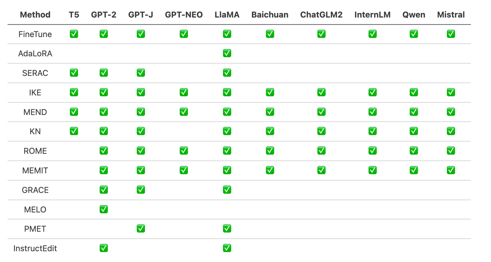
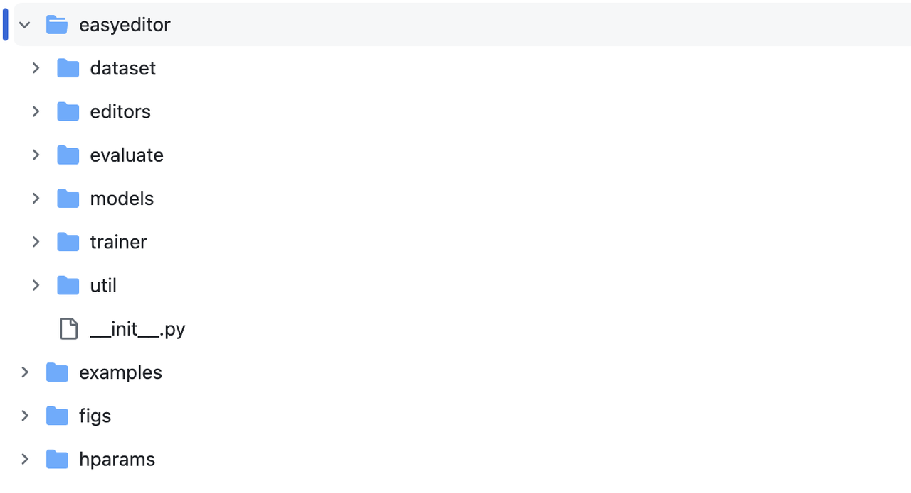
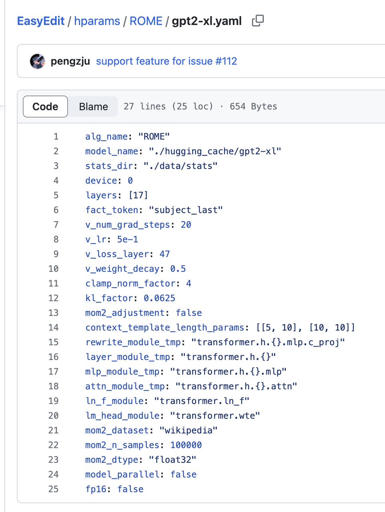
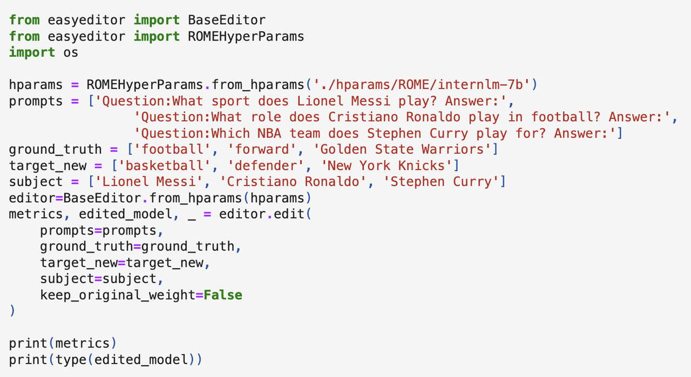
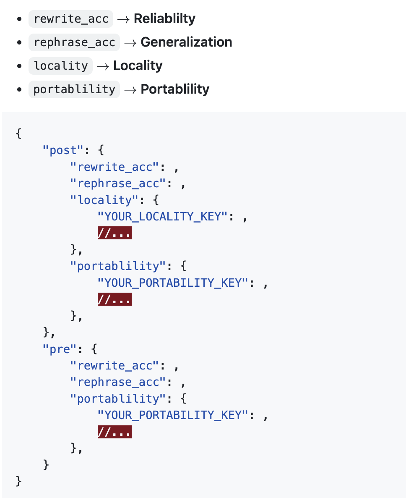

# Dive into Large Models: Knowledge Editing for Large Language Models
Guide: Methods and tools for editing language models
> Want to control a language model's memory of specific knowledge? Let's select an appropriate editing method, edit specific knowledge, and validate the edited model!

## 1. Tutorial Objectives:

- Become familiar with the EasyEdit toolkit
- Master the editing methods for language models (basics)
- Understand the selection and application scenarios for different types of editing methods

## 2. Preparation:
### 2.1 Understanding EasyEdit

https://github.com/zjunlp/EasyEdit

EasyEdit is a Python package for editing language models such as GPT-J, Llama, GPT-NEO, GPT2, T5, etc. Its goal is to effectively change the behavior of a language model for a specific piece of knowledge without negatively impacting its performance on other inputs, while being easy to use and easy to extend.

EasyEdit integrates existing popular editing methods:


### 2.2 Main Framework


EasyEdit contains a unified Editor, Method, and Evaluate framework, which respectively represent editing scenarios, editing techniques, and evaluation methods.
- Editor: Describes the work scenario, containing the model to be edited, the knowledge to be edited, and other necessary hyperparameters.
- Method: The specific knowledge editing method to be used (e.g., ROME, MEND, etc.).
- Evaluate: Metrics for evaluating knowledge editing performance, including reliability, generality, locality, and portability.
- Trainer: Some editing methods require a certain training process, which is implemented by the Trainer module.
## 3. Environment Installation:
```
git clone https://github.com/zjunlp/EasyEdit.git
(Optional) conda create -n EasyEdit python=3.9.7
cd EasyEdit
pip install -r requirements.txt
```
## 4. Editing Examples
> Objective: Change the knowledge memory of GPT-2-XL, changing Lionel Messi's profession from football to basketball (football->basketball). 
Steps:
- Select editing method and prepare parameters
- Prepare data for knowledge editing
- Instantiate Editor
- Run!
Below is a detailed introduction using the ROME method as an example:
### 4.1 ROME
Jupyter Notebook: [https://colab.research.google.com/drive/1KkyWqyV3BjXCWfdrrgbR-QS3AAokVZbr?usp=sharing#scrollTo=zWfGkNb9FBJQ] 
- Select editing method and prepare parameters
  - Select ROME as the editing method and prepare the parameters needed for ROME and GPT2-XL.
  - For example: alg_name: "ROME", model_name: "./hugging_cache/gpt2-xl" or the local path to the model, "device": the GPU index to use
  - Other parameters can keep their defaults

- Prepare data for knowledge editing
    ```
    prompts = ['Question:What sport does Lionel Messi play? Answer:'] # x_e
    ground_truth = ['football'] # y
    target_new = ['basketball'] # y_e
    subject = ['Lionel Messi'] 
    ```
- Instantiate Editor, passing the prepared parameters to the BaseEditor class for instantiation to get a customized Editor instance.
    ```
    hparams = ROMEHyperParams.from_hparams('./hparams/ROME/gpt2-xl.yaml')
    editor=BaseEditor.from_hparams(hparams)
    ```
- Run! Call the edit method of the editor:
    ```
    metrics, edited_model, _ = editor.edit(
        prompts=prompts,
        ground_truth=ground_truth,
        target_new=target_new,
        subject=subject,
        keep_original_weight=False
    )
    ```

> Note: When editing a model for the first time, it will download Wiki corpora and calculate the state (stats_dir: "./data/stats") of each layer for that model and save it. This is then reused in each subsequent edit. Therefore, the first edit may be time-consuming; please be patient and ensure your network connection is stable.
### 4.2 Validation and Evaluation
editor.edit returns metrics (calculated by EasyEdit's Evaluate module). The format is:

To obtain numerical values for generality, locality, and portability, you need to pass evaluation data in the edit method.

Taking locality as an example, this will cause the edit method to calculate locality metrics, i.e., the accuracy of the model's responses on locality_inputs.
```
locality_inputs = {
    'neighborhood':{
        'prompt': ['Joseph Fischhof, the', 'Larry Bird is a professional', 'In Forssa, they understand'],
        'ground_truth': ['piano', 'basketball', 'Finnish']
    }
}
metrics, edited_model, _ = editor.edit(
    prompts=prompts,
    ground_truth=ground_truth,
    target_new=target_new,
    locality_inputs=locality_inputs,
    keep_original_weight=False
)
```
Or directly compare the generate behavior of the model before and after editing.
```
generation_prompts = [
    "Lionel Messi, the",
    "The law in Ikaalinen declares the language"
]

model = GPT2LMHeadModel.from_pretrained('./hugging_cache/gpt2').to('cuda')
batch = tokenizer(generation_prompts, return_tensors='pt', padding=True, max_length=30)

pre_edit_outputs = model.generate(
    input_ids=batch['input_ids'].to('cuda'),
    attention_mask=batch['attention_mask'].to('cuda'),
    max_new_tokens=3
)
post_edit_outputs = edited_model.generate(
    input_ids=batch['input_ids'].to('cuda'),
    attention_mask=batch['attention_mask'].to('cuda'),
    max_new_tokens=3)
```
## 5. Large-Scale Editing (Optional)
### 5.1 Batch edit
Multiple pieces of data can form parallel lists and be passed to the edit method simultaneously for batch editing. In this case, MEMIT is the best method. (https://colab.research.google.com/drive/1P1lVklP8bTyh8uxxSuHnHwB91i-1LW6Z)
```
prompts = ['Question:What sport does Lionel Messi play? Answer:',
            'The law in Ikaalinen declares the language']
ground_truth = ['football', 'Finnish']
target_new = ['basketball', 'Swedish']
subject = ['Lionel Messi', 'Ikaalinen']
```
### 5.2 Testing on Benchmarks
- Counterfact
- ZsRE
```
{
    "case_id": 4402,
    "pararel_idx": 11185,
    "requested_rewrite": {
      "prompt": "{} debuted on",
      "relation_id": "P449",
      "target_new": {
        "str": "CBS",
        "id": "Q43380"
      },
      "target_true": {
        "str": "MTV",
        "id": "Q43359"
      },
      "subject": "Singled Out"
    },
    "paraphrase_prompts": [
      "No one on the ground was injured.  v",
      "The sex ratio was 1063. Singled Out is to debut on"
    ],
    "neighborhood_prompts": [
      "Daria premieres on",
      "Teen Wolf was originally aired on",
      "Spider-Man: The New Animated Series was originally aired on",
      "Celebrity Deathmatch premiered on",
      "Aeon Flux premiered on",
      "My Super Psycho Sweet 16 premieres on",
      "Daria was released on",
      "Jersey Shore premiered on",
      "Skins was originally aired on",
      "All You've Got premiered on"
    ]
  }
  ```
https://github.com/zjunlp/EasyEdit/blob/main/examples/run_zsre_llama2.py
