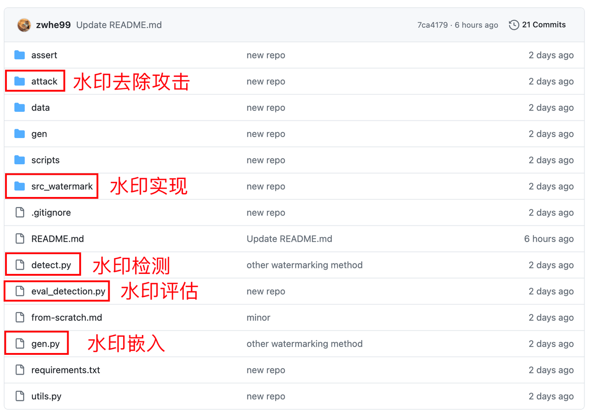
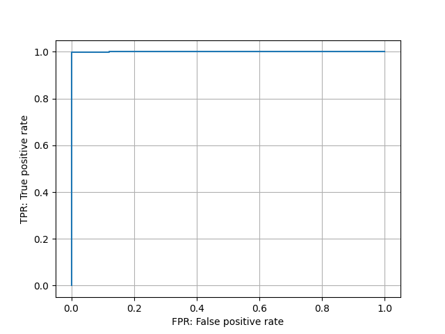

# Getting Started with Large Models: Model Watermarking

Guide: This section introduces watermarking for language models.

> Embedding imperceptible watermarks in language model-generated content that can be detected algorithmically.

## Tutorial Objectives

1. Watermark Embedding: Embed watermarks during language model content generation
2. Watermark Detection: Detect the watermark strength of given text
3. Watermark Evaluation: Evaluate the detection performance of watermarking methods
4. Assess Watermark Robustness (Optional)


## Preparation

### 2.1 Understanding the X-SIR Repository

https://github.com/zwhe99/X-SIR

The X-SIR repository contains implementations of the following:

- Three text watermarking algorithms: X-SIR, SIR, and KGW
- Two watermark removal attack methods: paraphrase and translation



### 2.2 Environment Setup

```Shell
git clone https://github.com/zwhe99/X-SIR && cd X-SIR
conda create -n xsir python==3.10.10
conda activate xsir
pip3 install -r requirements.txt
# [optional] pip3 install flash-attn==2.3.3
```

> The versions in requirements.txt are recommended versions, not strict requirements.


## Practical Examples

> Embedding watermarks in language model-generated content using the KGW algorithm

### 3.1 Data Preparation

Organize prompts to be input to the language model into a jsonl file:

```JSON
{"prompt": "Ghost of Emmett Till: Based on Real Life Events "}
{"prompt": "Antique Cambridge Glass Pink Decagon Console Bowl Engraved Gold Highlights\n"}
{"prompt": "2009 > Information And Communication Technology Index statistics - Countries "}
......
```

- Each line is a JSON object and must contain at least a key named "prompt"
- Subsequent examples use the file `data/dataset/mc4/mc4.en.jsonl`. This file contains 500 data points total. If you find model processing takes too long, consider reducing the data size.

### 3.2 Watermark Embedding

- Select a model and watermarking algorithm. Here we select the `baichuan-inc/Baichuan-7B` model and the `KGW` watermarking algorithm.

  - ```Shell
    MODEL_NAME=baichuan-inc/Baichuan-7B
    MODEL_ABBR=baichuan-7b
    WATERMARK_METHOD_FLAG="--watermark_method kgw"
    ```

- Generate content and embed watermarks

  - ```Shell
    python3 gen.py \
        --base_model $MODEL_NAME \
        --fp16 \
        --batch_size 32 \
        --input_file data/dataset/mc4/mc4.en.jsonl \
        --output_file gen/$MODEL_ABBR/kgw/mc4.en.mod.jsonl \
        $WATERMARK_METHOD_FLAG
    ```

  - This command saves the model-generated content to the output file: `gen/$MODEL_ABBR/kgw/mc4.en.mod.jsonl`

  - The output file format is as follows, where response is the model's output content:

    - ```JSON
      {"prompt": "Ghost of Emmett Till: Based on Real Life Events ", "response": ".In August if 1955 African American Emmett Louis Till (21)\nThe second part of The Man From Waco, about Dan Millers trial for murdering his friend Michael Capps in a Texas wiener wrastle as I believe the statute says called it then; back at that time that would have surely occurred since Dan kept his pistol in one of those watery doggy bags he keeps around to clean himself with after emptying can into a nearby lake just minutes before committing his crime. If what we read is true thats exactly where Dan left his stolen gun and later used it in the robbery gone wrong which killed two innocent boys when his own accomplice got into an argument over not being paid enough therefore wanting out. This angered Miller whos history of mental instability could be taken one way or another but this criminal act was unavoidable once they entered FBIs hands and some other very powerful law officers who were involved either directly"}
      {"prompt": "Antique Cambridge Glass Pink Decagon Console Bowl Engraved Gold Highlights\n", "response": "An exceptionally fine decorative antique pink decagonal glass side bowl is the perfect example of early art and innovation . Fully engraved, this beautiful English vintage tableware piece exhibits a great degree on craftsmanship! Made in England during the mid 1800's it features three sets of concentric ribbons on the exterior to elegantly highlight an intricate, deep reddish color which evokes warmth and comfort for years to come! This historically significant vase has been featured within numerous museum exhibitions including \"Glass at The Corning Museum\" ; \"The First Half Century\" & a special travelling exhibit called:\" Sight Of Glass: British Cut Glass\" by ibex limited (retailer) as well as \"SIGNALS - Celebrating History In American Silver Through The Articulated Bottle Vessel\" presented at the Corning Museum of Glass 2012 ASA national symposium! We provide our customers with quality phot"}
      {"prompt": "2009 > Information And Communication Technology Index statistics - Countries ", "response": "5/22/2016\nAnnual change of mobile telephone subscriptions in Armenia (per 1 population). 2.2% increase is equivalent to 38 subscriptions per 100 people. Density rank: 121 out of 222.\nCyclist(s)/month(S). Likes bike riding? Take advantage of discount and cheap rental bikes at Rimon Bike Rentals in Yerevan! No advance payments or additional deposits are required. They have a good range of bicycles, including mountainbikes. More on their Facebook page \nYou must know about electric cars. The Renault Fluence KZERO gets it right in the city but I'm not sure what mileage you can expect from it. Still its fun project http://www.renault-kzen.com\nFor more on this and related issues : Armenian Institute for Electronic Governance reports |"}
      ......
      ```


### 3.3 Watermark Detection

> Watermark detection means computing the watermark strength (z-score) of a given text.

- Calculate the watermark strength of **watermarked** text

  - ```python
    python3 detect.py \
        --base_model $MODEL_NAME \
        --detect_file gen/$MODEL_ABBR/kgw/mc4.en.mod.jsonl \
        --output_file gen/$MODEL_ABBR/kgw/mc4.en.mod.z_score.jsonl \
        $WATERMARK_METHOD_FLAG
    ```

- Calculate the watermark strength of **non-watermarked** text

  - ```python
    python3 detect.py \
        --base_model $MODEL_NAME \
        --detect_file data/dataset/mc4/mc4.en.jsonl \
        --output_file gen/$MODEL_ABBR/kgw/mc4.en.hum.z_score.jsonl \
        $WATERMARK_METHOD_FLAG
    ```

- The output file format is:

  - ```JSON
    {"z_score": 12.105422509165574, "prompt": "Ghost of Emmett Till: Based on Real Life Events ", "response": ".In August if 1955 African American Emmett Louis Till (21)\nThe second part of The Man From Waco, about Dan Millers trial for murdering his friend Michael Capps in a Texas wiener wrastle as I believe the statute says called it then; back at that time that would have surely occurred since Dan kept his pistol in one of those watery doggy bags he keeps around to clean himself with after emptying can into a nearby lake just minutes before committing his crime. If what we read is true thats exactly where Dan left his stolen gun and later used it in the robbery gone wrong which killed two innocent boys when his own accomplice got into an argument over not being paid enough therefore wanting out. This angered Miller whos history of mental instability could be taken one way or another but this criminal act was unavoidable once they entered FBIs hands and some other very powerful law officers who were involved either directly", "biases": null}
    {"z_score": 12.990684249887122, "prompt": "Antique Cambridge Glass Pink Decagon Console Bowl Engraved Gold Highlights\n", "response": "An exceptionally fine decorative antique pink decagonal glass side bowl is the perfect example of early art and innovation . Fully engraved, this beautiful English vintage tableware piece exhibits a great degree on craftsmanship! Made in England during the mid 1800's it features three sets of concentric ribbons on the exterior to elegantly highlight an intricate, deep reddish color which evokes warmth and comfort for years to come! This historically significant vase has been featured within numerous museum exhibitions including \"Glass at The Corning Museum\" ; \"The First Half Century\" & a special travelling exhibit called:\" Sight Of Glass: British Cut Glass\" by ibex limited (retailer) as well as \"SIGNALS - Celebrating History In American Silver Through The Articulated Bottle Vessel\" presented at the Corning Museum of Glass 2012 ASA national symposium! We provide our customers with quality phot", "biases": null}
    {"z_score": 11.455466938203664, "prompt": "2009 > Information And Communication Technology Index statistics - Countries ", "response": "5/22/2016\nAnnual change of mobile telephone subscriptions in Armenia (per 1 population). 2.2% increase is equivalent to 38 subscriptions per 100 people. Density rank: 121 out of 222.\nCyclist(s)/month(S). Likes bike riding? Take advantage of discount and cheap rental bikes at Rimon Bike Rentals in Yerevan! No advance payments or additional deposits are required. They have a good range of bicycles, including mountainbikes. More on their Facebook page \nYou must know about electric cars. The Renault Fluence KZERO gets it right in the city but I'm not sure what mileage you can expect from it. Still its fun project http://www.renault-kzen.com\nFor more on this and related issues : Armenian Institute for Electronic Governance reports |", "biases": null}
    ......
    ```

- Visually compare the watermark strengths between the two files

### 3.4 Watermark Evaluation
<a name="eval"></a>

- Input the z-score files from watermark detection, calculate detection accuracy, and plot the ROC curve

  - ```Shell
    python3 eval_detection.py \
            --hm_zscore gen/$MODEL_ABBR/kgw/mc4.en.hum.z_score.jsonl \
            --wm_zscore gen/$MODEL_ABBR/kgw/mc4.en.mod.z_score.jsonl \
            --roc_curve roc
    
    AUC: 1.000
    
    TPR@FPR=0.1: 0.998
    TPR@FPR=0.01: 0.998
    
    F1@FPR=0.1: 0.999
    F1@FPR=0.01: 0.999
    ```



## Assessing Watermark Robustness (Optional)

> Re-evaluate detection performance after launching paraphrase and translation attacks on watermarked text

### 4.1 Preparation

We use the gpt-3.5-turbo-1106 model to perform paraphrase and translation on watermarked text. You can also choose other tools.

- Set up your OpenAI API key

  - ```Shell
    export OPENAI_API_KEY=xxxx
    ```

- Modify RPM (requests per min) and TPM (tokens per min) in `attack/const.py`

### 4.2 Launching Attacks (Translation Example)

- Translate watermarked text into Chinese

  - ```Shell
    python3 attack/translate.py \
        --input_file gen/$MODEL_ABBR/kgw/mc4.en.mod.jsonl \
        --output_file gen/$MODEL_ABBR/kgw/mc4.en-zh.mod.jsonl \
        --model gpt-3.5-turbo-1106 \
        --src_lang en \
        --tgt_lang zh
    ```

- Re-evaluate

  - See [3.4](#eval)

- Compare changes in watermark performance before and after attacks


## Advanced Exercises

- Consult the [X-SIR](https://github.com/zwhe99/X-SIR) documentation to learn how to use the other two algorithms (X-SIR, SIR), and evaluate their performance under different attack methods
