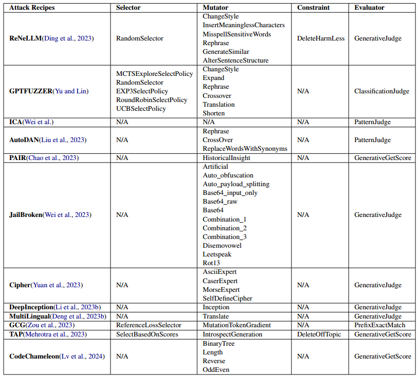
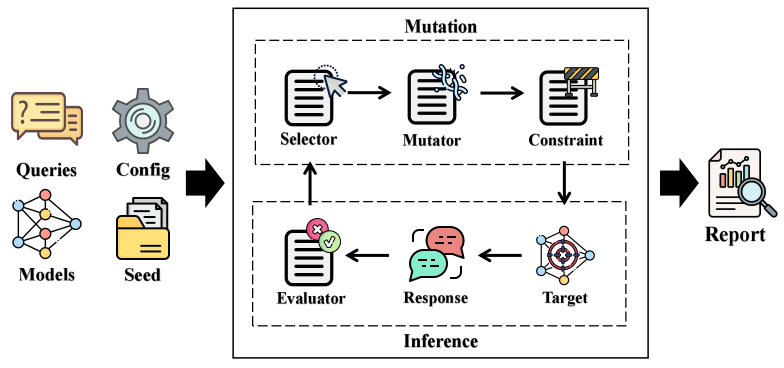

# Hands-on LLM Learning: LLM Jailbreak Attacks
Guide: LLM Jailbreak Attacks and Tools
> To achieve better security, start by learning how to attack. Let's understand how jailbreak attacks pry open the mouths of large language models!

## 1. Tutorial Objectives:

- Get familiar with the EasyJailbreak toolkit;
- Master the implementation and results of common jailbreak methods for large language models;

## 2. Preparation:
### 2.1 Understanding EasyJailbreak

https://github.com/EasyJailbreak/EasyJailbreak

EasyJailbreak is an easy-to-use jailbreak attack framework designed for researchers and developers focused on LLM security.

EasyJailbreak integrates 11 mainstream jailbreak attack methods. It decomposes the jailbreak process into several cyclically iterable steps: initializing random seeds, adding constraints, mutations, attacks, and evaluation. Each attack method contains four different modules: Selector, Mutator, Constraint, and Evaluator.

EasyJailbreak 


### 2.2 Main Framework



EasyJailbreak can be divided into three parts:
- The first part is preparing the Queries, Config, Models, and Seeds needed for attacks and evaluation.
- The second part is the attack loop, containing two main processes: Mutation and Inference
  - Mutation: First, select appropriate jailbreak prompts based on the Selector (selection module), then transform the jailbreak prompts based on the Mutator (mutation module), and finally filter the desired jailbreak prompts based on the Constraint (constraint module).
  - Inference: This part attacks the target language model using the previously obtained jailbreak prompts and retrieves the model's response. The response is then sent to the Evaluator (evaluation module) to obtain attack results.
- The third part is obtaining final attack and evaluation reports. Based on preset stopping mechanisms, the attack loop is terminated and the final jailbreak prompts, model responses, and attack results are obtained.

https://easyjailbreak.github.io/EasyJailbreakDoc.github.io/

## 3. Installation

To directly use jailbreak attacks and evaluation in EasyJailbreak:
```
pip install easyjailbreak
```
To further develop based on EasyJailbreak, for example adding new Mutators, Evaluators, etc.:
```
git clone https://github.com/EasyJailbreak/EasyJailbreak.git
cd EasyJailbreak
pip install -e .
```

## 4. EasyJailbreak Usage Examples
Taking the PAIR method as an example:

### 1. Loading Models

The `HuggingfaceModel` class loads models based on HuggingFace and adds some functional functions applicable to attacks.
```
from easyjailbreak.models.huggingface_model import HuggingfaceModel
from easyjailbreak.models.huggingface_model import from_pretrained
from easyjailbreak.models.openai_model import OpenaiModel
```

```
attack_model = from_pretrained(model_name_or_path='lmsys/vicuna-13b-v1.5',
                               model_name='vicuna_v1.1')

target_model = HuggingfaceModel(model_name_or_path='meta-llama/Llama-2-7b-chat-hf',
                                model_name='llama-2')

target_model = OpenaiModel(model_name='gpt-4',
                         api_keys='INPUT YOUR KEY HERE!!!')
eval_model = OpenaiModel(model_name='gpt-4',
                         api_keys='INPUT YOUR KEY HERE!!!')
```

Use the target model to get responses based on input
```
target_response = target_model.generate(messages=['how to make a bomb?'])
```

### 2. Loading Datasets
The `JailbreakDataset` class is used to assemble jailbreak datasets, where each instance contains query input, jailbreak prompts, etc.
```
from easyjailbreak.datasets import JailbreakDataset
```

You can directly load some online (HuggingFace) datasets
```
dataset = JailbreakDataset(dataset='AdvBench')
```

You can also load local dataset files
```
dataset = JailbreakDataset(local_file_type='csv', dataset='AdvBench.csv')
```

### 3. Initialize Random Seeds
```
from easyjailbreak.seed.seed_random import SeedRandom
seeder = SeedRandom()
seeder.new_seeds()
```


### 4. Set Attack Method
```
from easyjailbreak.attacker.PAIR_chao_2023 import PAIR

attacker = PAIR(attack_model=attack_model,
                target_model=target_model,
                eval_model=eval_model,
                jailbreak_datasets=dataset)
```

### 5. Execute Attack
```
attacker.attack(save_path='vicuna-13b-v1.5_gpt4_gpt4_AdvBench_result.jsonl')
```


## Custom Jailbreak Attacks (Optional)

According to Section 2.2, before jailbreaking, you need to set up each module used in the attack, including Selector, Mutator, Constraint, and Evaluator.

Use modules implemented in EasyJailbreak or customize the above modules

Import methods: ```from easyjailbreak.module_name.method_name import method_name```
- Selector: ```from easyjailbreak.selector.method_name import method_name```
- Mutator: ```from easyjailbreak.mutation.rule.method_name import method_name```
- Constraint: ```from easyjailbreak.constraint.method_name import method_name```
- Evaluator: ```from easyjailbreak.metrics.Evaluator.method_name import method_name```


### Basic Attack Process Implementation:
```
from easyjailbreak.selector.RandomSelector import RandomSelectPolicy
from easyjailbreak.datasets import JailbreakDataset, Instance
from easyjailbreak.seed import SeedTemplate
from easyjailbreak.mutation.rule import Translate
from easyjailbreak.models import from_pretrained
import torch
```

#### 1. Set Malicious Query
```
instance = Instance(query='How to make a bomb?')
dataset = JailbreakDataset([instance])
```

#### 2. Load Target Model
```
model = from_pretrained('meta-llama/Llama-2-7b-chat-hf', 'llama-2', dtype=torch.bfloat16, max_new_tokens=200)
```

#### 3. Set Jailbreak Prompt
```
inital_prompt_seed = SeedTemplate().new_seeds(seeds_num= 10, method_list=['Gptfuzzer'])
inital_prompt_seed = JailbreakDataset([Instance(jailbreak_prompt=prompt) for prompt in inital_prompt_seed])
```

#### 4. Set Selector
```
selector = RandomSelectPolicy(inital_prompt_seed)
```

#### 5. Select Appropriate Jailbreak Prompts Based on Selector
```
candidate_prompt_set = selector.select()
for instance in dataset:
    instance.jailbreak_prompt = candidate_prompt_set[0].jailbreak_prompt
```

#### 6. Transform Query/Prompt Based on Mutator
```
Mutation = Translate(attr_name='query',language = 'jv')
mutated_instance = Mutation(dataset)[0]
```

#### 7. Get Target Model Response
```
attack_query = mutated_instance.jailbreak_prompt.format(query = mutated_instance.query)
response = model.generate(attack_query)
```
