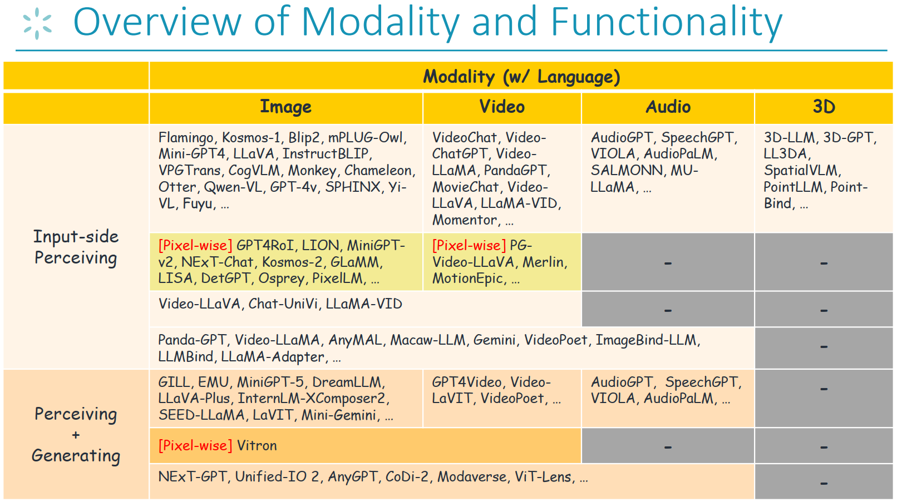
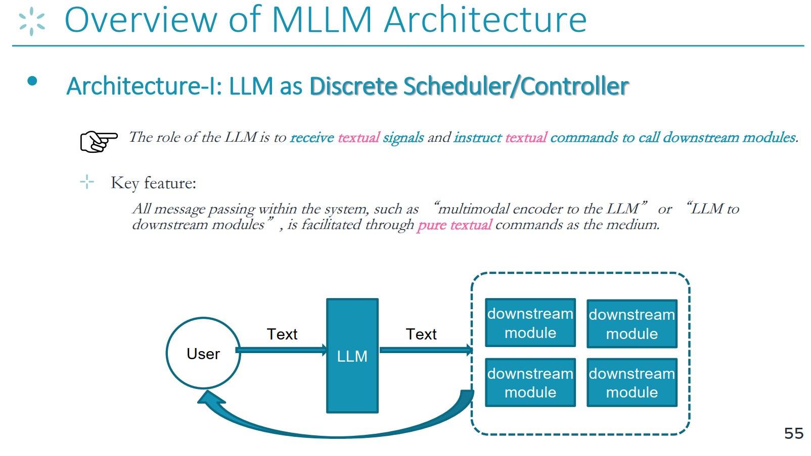
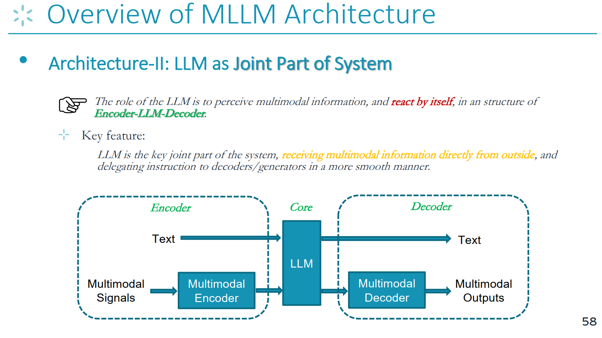
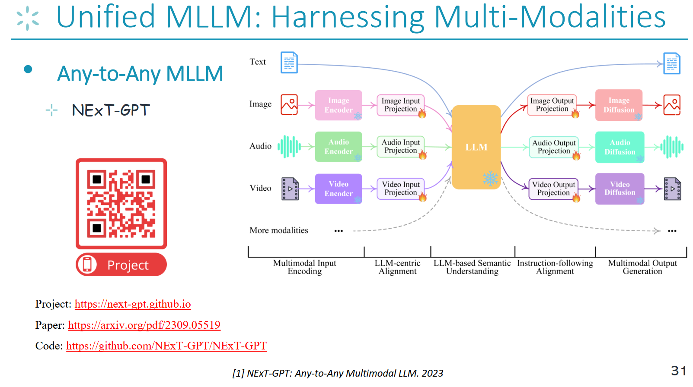
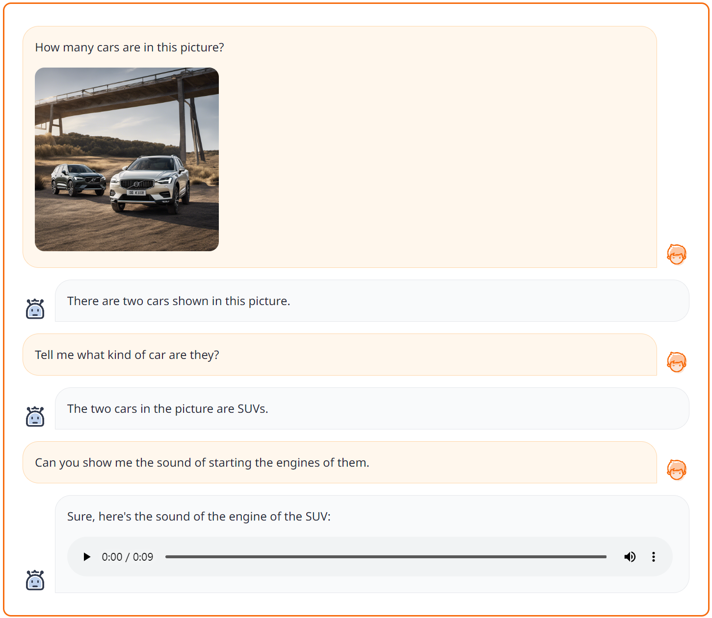
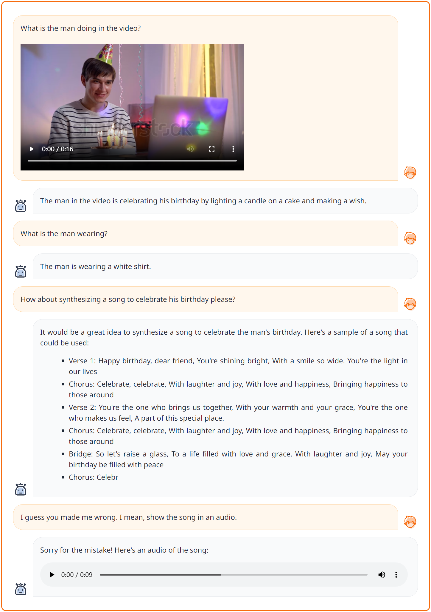
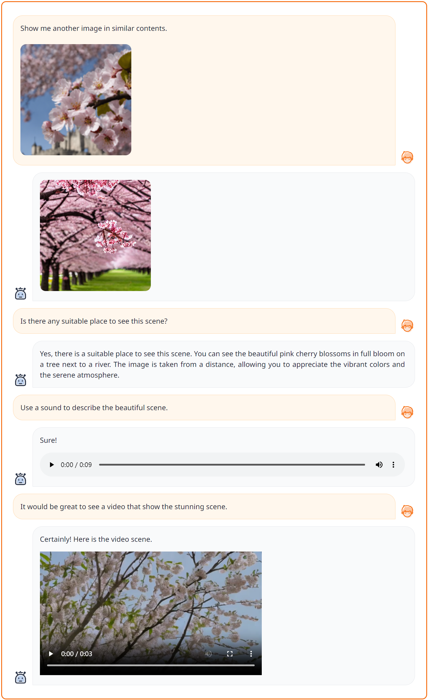
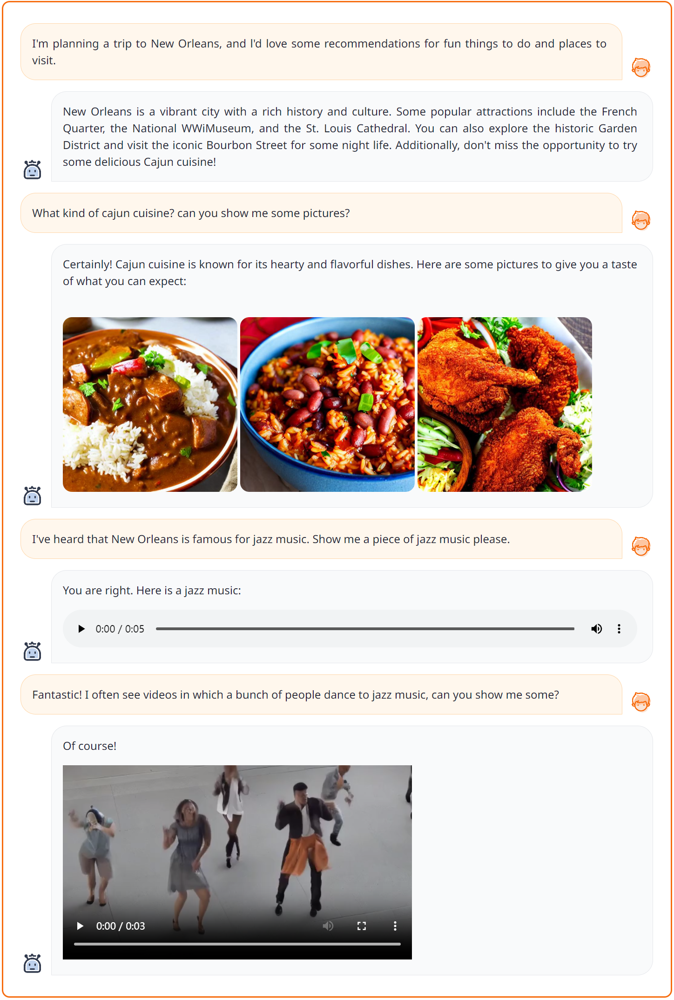

# Hands-on Learning with Large Models: Multimodal Large Language Models

Introduction: This section covers the common architectures and construction methods of multimodal large language models.

> The emergence of large language models has shown everyone that advanced intelligence is fully manifested in the language modality. As multimodal large language models that can more comprehensively simulate the real world, how do they implement stronger multimodal understanding and generation capabilities? Can multimodal large language models help achieve AGI?


## Learning Objectives for This Tutorial

1. Familiarize with the types of multimodal large language models
2. Master the general technical framework of multimodal large language models
3. Master the construction, training, and inference of multimodal large language models


## 1. Theoretical Knowledge Preparation


### 1.1 Understanding Types of Multimodal Large Language Models

- Classification of existing multimodal large language models by functionality and modality support


> Before constructing multimodal large language models (MLLMs), researchers in this field have reached a consensus and a key prerequisite: due to scaling laws and emergent phenomena, current language-based LLMs have demonstrated powerful semantic understanding capabilities. This means that language has become the key modality for carrying intelligence, so linguistic intelligence is considered the hub of multimodal intelligence. Therefore, almost all MLLMs are built upon language-based LLMs, with the LLM serving as the core decision-making module, similar to the brain or central processing unit. In other words, by adding additional external non-textual modality modules or encoders, the LLM is granted multimodal perception/operation capabilities.

We categorize existing MLLMs into different types based on their modality support and functional capabilities.




- Read the complete tutorial: [[Slides](https://github.com/Lordog/dive-into-llms/blob/main/documents/chapter6/mllms.pdf)] 


- More related surveys
    - [A Survey on Multimodal Large Language Models, https://github.com/BradyFU/Awesome-Multimodal-Large-Language-Models, 2023](https://github.com/BradyFU/Awesome-Multimodal-Large-Language-Models)
    - [MM-LLMs: Recent Advances in MultiModal Large Language Models, 2023](https://arxiv.org/pdf/2401.13601)


### 1.2 Understanding the General Technical Framework of Multimodal Large Language Models


- Architecture 1: LLM as Task Scheduler

> There are currently two common MLLM architectures in the community.
The first is the "LLM as discrete scheduler/controller" architecture. As shown in the diagram below, the LLM's role is to receive text signals and issue text commands to downstream modules. All message passing within the system is mediated by pure text commands output by the LLM. There is no interaction between different functional modules.




- Architecture 2: LLM as Joint Part of System

> The second architecture is the encoder-LLM-decoder framework.
This is also the most popular architecture currently. The LLM's role is to perceive multimodal information and make responses and operations within an encoder-LLM-decoder structure. Therefore, the key difference between this architecture and the first is that the LLM serves as a critical joint component of the system, directly receiving multimodal information from external sources, and delegating instructions to the decoder/generator in a more seamless manner. In the encoder-LLM-decoder framework, as shown in the diagram below, the encoder processes encoded signals from multiple modalities, the LLM acts as the core decision-maker, and the decoder manages multimodal outputs.




## 2. Hands-on Practice with General Multimodal Large Language Models

> Practice the construction process of universal "any-to-any modality" multimodal large language models


### 2.1 Universal "Any-to-Any Modality" Multimodal Large Language Model: NExT-GPT

> Future MLLM research will certainly move towards increasingly universal generalist directions, incorporating as many modalities and functions as possible. NExT-GPT is one of the most pioneering works in this field, and it was the first to introduce the concept of "any-to-any modality" MLLM. This architecture achieves powerful functionality and establishes the foundation for future research directions in multimodal large language models.




> For the code practice section of this course on multimodal large language models, we will use NExT-GPT's code as a target for in-depth yet accessible analysis and practice.

[NExT-GPT Project](https://next-gpt.github.io/)

[NExT-GPT GitHub Repository](https://github.com/NExT-GPT/NExT-GPT)


### 2.2 Code Framework Overview


```
├── figures
├── data
│   ├── T-X_pair_data  
│   │   ├── audiocap                      # text-audio pairs data
│   │   │   ├── audios                    # audio files
│   │   │   └── audiocap.json             # the audio captions
│   │   ├── cc3m                          # text-image pairs data
│   │   │   ├── images                    # image files
│   │   │   └── cc3m.json                 # the image captions
│   │   └── webvid                        # text-video pairs data
│   │   │   ├── videos                    # video files
│   │   │   └── webvid.json               # the video captions
│   ├── IT_data                           # instruction data
│   │   ├── T+X-T_data                    # text+[image/audio/video] to text instruction data
│   │   │   ├── alpaca                    # textual instruction data
│   │   │   ├── llava                     # visual instruction data
│   │   ├── T-T+X                         # synthesized text to text+[image/audio/video] instruction data
│   │   └── MosIT                         # Modality-switching Instruction Tuning instruction data
├── code
│   ├── config
│   │   ├── base.yaml                     # the model configuration 
│   │   ├── stage_1.yaml                  # enc-side alignment training configuration
│   │   ├── stage_2.yaml                  # dec-side alignment training configuration
│   │   └── stage_3.yaml                  # instruction-tuning configuration
│   ├── dsconfig
│   │   ├── stage_1.json                  # deepspeed configuration for enc-side alignment training
│   │   ├── stage_2.json                  # deepspeed configuration for dec-side alignment training
│   │   └── stage_3.json                  # deepspeed configuration for instruction-tuning training
│   ├── datast
│   │   ├── base_dataset.py
│   │   ├── catalog.py                    # the catalog information of the dataset
│   │   ├── cc3m_datast.py                # process and load text-image pair dataset
│   │   ├── audiocap_datast.py            # process and load text-audio pair dataset
│   │   ├── webvid_dataset.py             # process and load text-video pair dataset
│   │   ├── T+X-T_instruction_dataset.py  # process and load text+x-to-text instruction dataset
│   │   ├── T-T+X_instruction_dataset.py  # process and load text-to-text+x instruction dataset
│   │   └── concat_dataset.py             # process and load multiple dataset
│   ├── model                     
│   │   ├── ImageBind                     # the code from ImageBind Model
│   │   ├── common
│   │   ├── anyToImageVideoAudio.py       # the main model file
│   │   ├── agent.py
│   │   ├── modeling_llama.py
│   │   ├── custom_ad.py                  # the audio diffusion 
│   │   ├── custom_sd.py                  # the image diffusion
│   │   ├── custom_vd.py                  # the video diffusion
│   │   ├── layers.py                     # the output projection layers
│   │   └── ...  
│   ├── scripts
│   │   ├── train.sh                      # training NExT-GPT script
│   │   └── app.sh                        # deploying demo script
│   ├── header.py
│   ├── process_embeddings.py             # precompute the captions embeddings
│   ├── train.py                          # training
│   ├── inference.py                      # inference
│   ├── demo_app.py                       # deploy Gradio demonstration 
│   └── ...
├── ckpt                           
│   ├── delta_ckpt                        # tunable NExT-GPT params
│   │   ├── nextgpt         
│   │   │   ├── 7b_tiva_v0                # the directory to save the log file
│   │   │   │   ├── log                   # the logs
│   └── ...       
│   ├── pretrained_ckpt                   # frozen params of pretrained modules
│   │   ├── imagebind_ckpt
│   │   │   ├──huge                       # version
│   │   │   │   └──imagebind_huge.pth
│   │   ├── vicuna_ckpt
│   │   │   ├── 7b_v0                     # version
│   │   │   │   ├── config.json
│   │   │   │   ├── pytorch_model-00001-of-00002.bin
│   │   │   │   ├── tokenizer.model
│   │   │   │   └── ...
├── LICENCE.md
├── README.md
└── requirements.txt
```


### 2.3 Environment Setup

First, clone the repository and install the required environment. You can complete the environment installation by running the following commands:

```
conda env create -n nextgpt python=3.8

conda activate nextgpt

# CUDA 11.6
conda install pytorch==1.13.1 torchvision==0.14.1 torchaudio==0.13.1 pytorch-cuda=11.6 -c pytorch -c nvidia

git clone https://github.com/NExT-GPT/NExT-GPT.git
cd NExT-GPT

pip install -r requirements.txt
```


### 2.4 Getting Started with System Inference


#### 2.4.1 Loading Pre-trained NExT-GPT Model Checkpoint

- **Step 1**: Load `frozen parameters`. [NExT-GPT](https://github.com/NExT-GPT/NExT-GPT) is trained based on the following existing models or modules. Please prepare the checkpoint according to the instructions below.
    - `ImageBind` is a unified image/video/audio encoder. You can download the pre-trained checkpoint from [here](https://dl.fbaipublicfiles.com/imagebind/imagebind_huge.pth), version `huge`. Then, place the `imagebind_huge.pth` file in [[./ckpt/pretrained_ckpt/imagebind_ckpt/huge]](ckpt/pretrained_ckpt/imagebind_ckpt/).
    - `Vicuna`: First, prepare LLaMA according to the instructions [[here]](ckpt/pretrained_ckpt/prepare_vicuna.md). Then place the pre-trained model in [[./ckpt/pretrained_ckpt/vicuna_ckpt/]](ckpt/pretrained_ckpt/vicuna_ckpt/).
    - `Image Diffusion` for image generation. NExT-GPT uses [Stable Diffusion](https://huggingface.co/runwayml/stable-diffusion-v1-5) version `v1-5`. (_The code will download it automatically_)
    - `Audio Diffusion` for audio content generation. NExT-GPT uses [AudioLDM](https://github.com/haoheliu/AudioLDM) version `l-full`. (_The code will download it automatically_)
    - `Video Diffusion` for video generation. We use [ZeroScope](https://huggingface.co/cerspense/zeroscope_v2_576w) version `v2_576w`. (_The code will download it automatically_)

- **Step 2**: Load `tunable parameters`.

Place the NExT-GPT system in [[./ckpt/delta_ckpt/nextgpt/7b_tiva_v0]](./ckpt/delta_ckpt/nextgpt/7b_tiva_v0). You can choose either 1) use your own trained parameters, or 2) download the pre-trained checkpoint from [Huggingface](https://huggingface.co/ChocoWu/nextgpt_7b_tiva_v0).


#### 2.4.2 Gradio Demo Deployment

After completing checkpoint loading, you can run the demo locally in the following way:
```angular2html
cd ./code
bash scripts/app.sh
```
Specify key parameters as follows:
- `--nextgpt_ckpt_path`: Path to the pre-trained NExT-GPT parameters.


#### 2.4.3 Testing Examples in Practice

The current version supports inputs from any combination of four modalities: text, image, video, and audio, and outputs combined modalities.
It also supports multi-turn contextual interaction.

Please run the tests yourself to see the effects.

- **Case-1**: Input T+I, output T+A




- **Case-2**: Input T+V, output T+A




- **Case-3**: Input T+I, output T+I+V




- **Case-4**: Input T, output T+I+V+A




### 2.5 System Training Process


#### 2.5.1 Data Preparation

Please download the following datasets for model training:

A) T-X Pair Data
  - `CC3M` data for ***text-image*** pairs, please follow the instructions [[here]](./data/T-X_pair_data/cc3m/prepare.md). Then place the data in [[./data/T-X_pair_data/cc3m]](./data/T-X_pair_data/cc3m).
  - `WebVid` data for ***text-video*** pairs, refer to [[instructions]](./data/T-X_pair_data/webvid/prepare.md). Files should be saved in [[./data/T-X_pair_data/webvid]](./data/T-X_pair_data/webvid).
  - `AudioCap` data for ***text-audio*** pairs, refer to [[instructions]](./data/T-X_pair_data/audiocap/prepare.md). Save the data in [[./data/T-X_pair_data/audiocap]](./data/T-X_pair_data/audiocap).

B) Instruction Fine-tuning Data
  - T+X-T
    - ***Visual instruction data*** (from `LLaVA`), download from [here](https://github.com/haotian-liu/LLaVA/blob/main/docs/Data.md) and place it in [[./data/IT_data/T+X-T_data/llava]](./data/IT_data/T+X-T_data/llava/).
    - ***Textual instruction data*** (from `Alpaca`), download from [here](https://github.com/tatsu-lab/stanford_alpaca) and place it in [[./data/IT_data/T+X-T_data/alpaca/]](data/IT_data/T+X-T_data/alpaca/).
    - ***Video instruction data*** (from `VideoChat`), download from [here](https://github.com/OpenGVLab/InternVideo/tree/main/Data/instruction_data) and place it in [[./data/IT_data/T+X-T_data/videochat/]](data/IT_data/T+X-T_data/videochat/).

    Note: After downloading the datasets, please run `preprocess_dataset.py` to preprocess the datasets to ensure uniform format.
  - T-X+T (T2M)
    - `T-X+T` instruction dataset (T2M) is saved in [[./data/IT_data/T-T+X_data]](./data/IT_data/T-T+X_data).
   
  - MosIT
    - Get the instructions for downloading data from [here](./data/IT_data/MosIT_data/). Finally, place it in [[./data/IT_data/MosIT_data/]](./data/IT_data/MosIT_data/).


#### 2.5.2 Embedding Preparation

In the decoder-side alignment training of NExT-GPT, we minimize the distance between Signal Tokens and caption representations. To ensure system efficiency and save time and memory costs, we use text encoders from the respective diffusion models to pre-compute text embeddings for image, audio, and video captions.

Before training NExT-GPT, please run the following command. The generated `embedding` files will be saved in [[./data/embed]](./data/embed).
```
cd ./code/
python process_embeddings.py ../data/T-X_pair_data/cc3m/cc3m.json image ../data/embed/ runwayml/stable-diffusion-v1-5
```


Parameter explanations:
- args[1]: Path to the caption file;
- args[2]: Modality, can be `image`, `video`, or `audio`;
- args[3]: Path to save embedding files;
- args[4]: Name of the corresponding pre-trained diffusion model.


#### 2.5.3 Three-Stage Training


First, refer to the base configuration file [[./code/config/base.yaml]](./code/config/base.yaml) to understand the basic system settings of the entire module.

Then run the following script to start NExT-GPT training:
```
cd ./code
bash scripts/train.sh
```

Specify the command as follows:
```
deepspeed --include localhost:0 --master_addr 127.0.0.1 --master_port 28459 train.py \
    --model nextgpt \
    --stage 1\
    --save_path  ../ckpt/delta_ckpt/nextgpt/7b_tiva_v0/\
    --log_path ../ckpt/delta_ckpt/nextgpt/7b_tiva_v0/log/
```
Key parameters:
- `--include`: `localhost:0` represents GPU CUDA number `0` in deepspeed.
- `--stage`: Training stage.
- `--save_path`: Directory to store the trained delta weights. This directory will be created automatically.
- `--log_path`: Directory to store log files.


The entire NExT-GPT training consists of 3 steps:

- **Step 1**: Encoder-side LLM-centric multimodal alignment. This stage trains the ***input projection layer*** while freezing ImageBind, LLM, and the output projection layer.
  
  Simply run the above `train.sh` script and set: `--stage 1`
  
  Also refer to the configuration file [[./code/config/stage_1.yaml]](./code/config/stage_1.yaml) and the deepspeed configuration file [[./code/dsconfig/stage_1.yaml]](./code/dsconfig/stage_1.yaml) for more step-by-step configuration information.

  Note that the datasets used in this step are included in `dataset_name_list`, and the dataset names must match exactly with the definitions in [[./code/dataset/catalog.py]](./code/dataset/catalog.py).


- **Step 2**: Decoder-side instruction-following alignment. This stage trains the ***output projection layer*** while freezing ImageBind, LLM, and the input projection layer.

  Simply run the above `train.sh` script and set: `--stage 2`

  Also refer to the configuration file [[./code/config/stage_2.yaml]](./code/config/stage_2.yaml) and the deepspeed configuration file [[./code/dsconfig/stage_2.yaml]](./code/dsconfig/stage_2.yaml) for more step-by-step configuration information.


- **Step 3**: Instruction tuning. This stage performs the following tuning on the instruction dataset: 1) tune the ***LLM*** through LoRA, 2) tune the ***input projection layer***, and 3) tune the ***output projection layer***.

  Simply run the above `train.sh` script and set: `--stage 3`

  Also refer to the configuration file [[./code/config/stage_3.yaml]](./code/config/stage_3.yaml) and the deepspeed configuration file [[./code/dsconfig/stage_3.yaml]](./code/dsconfig/stage_3.yaml) for more step-by-step configuration information.
